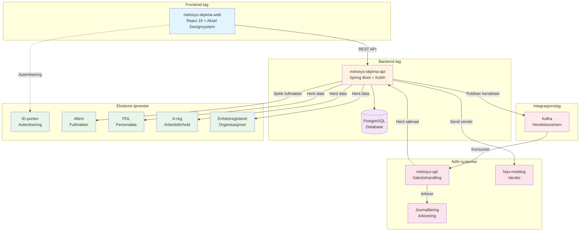
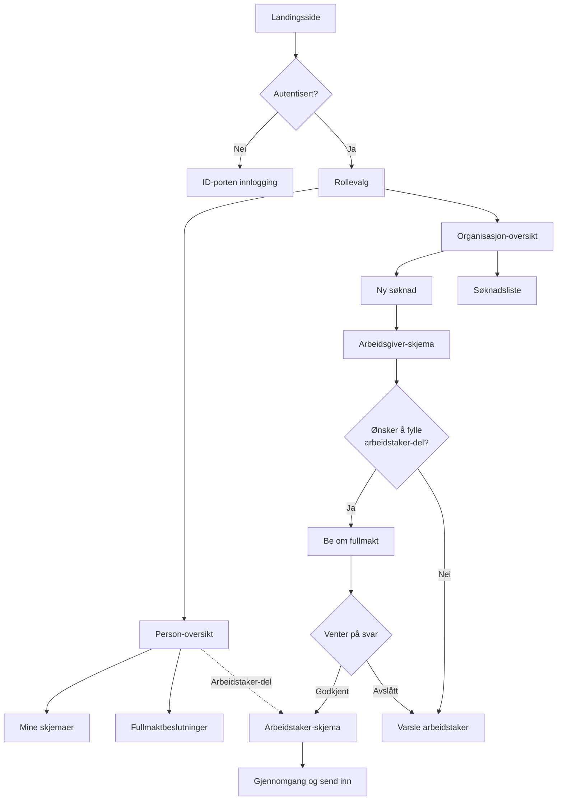
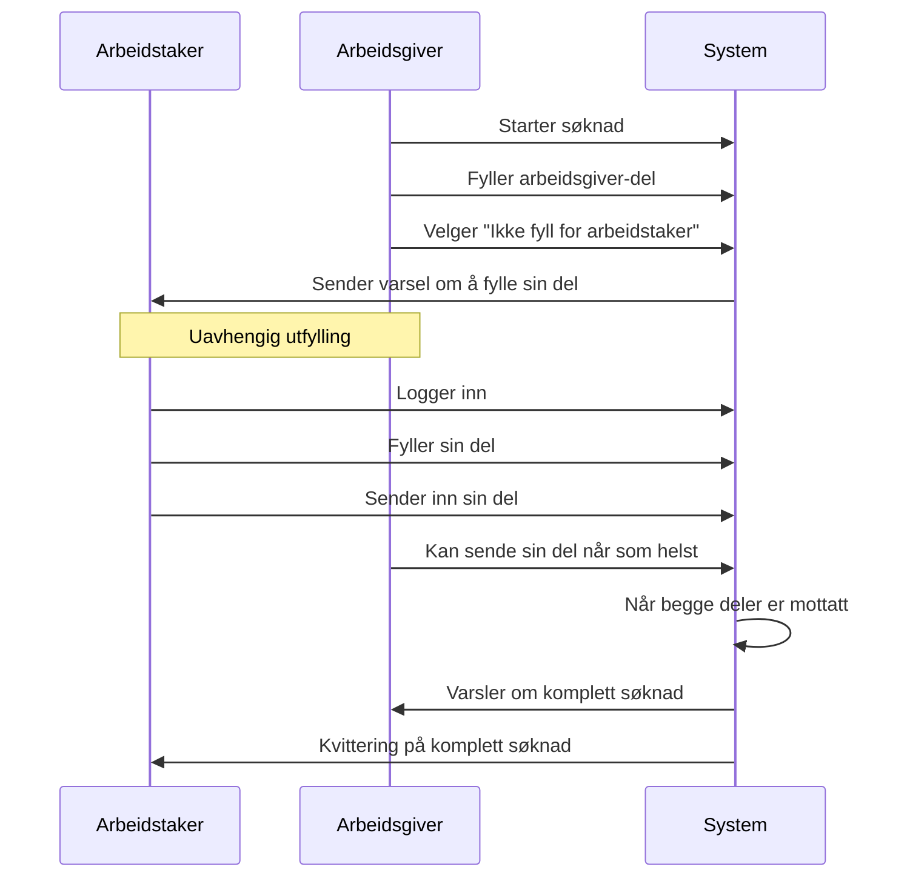
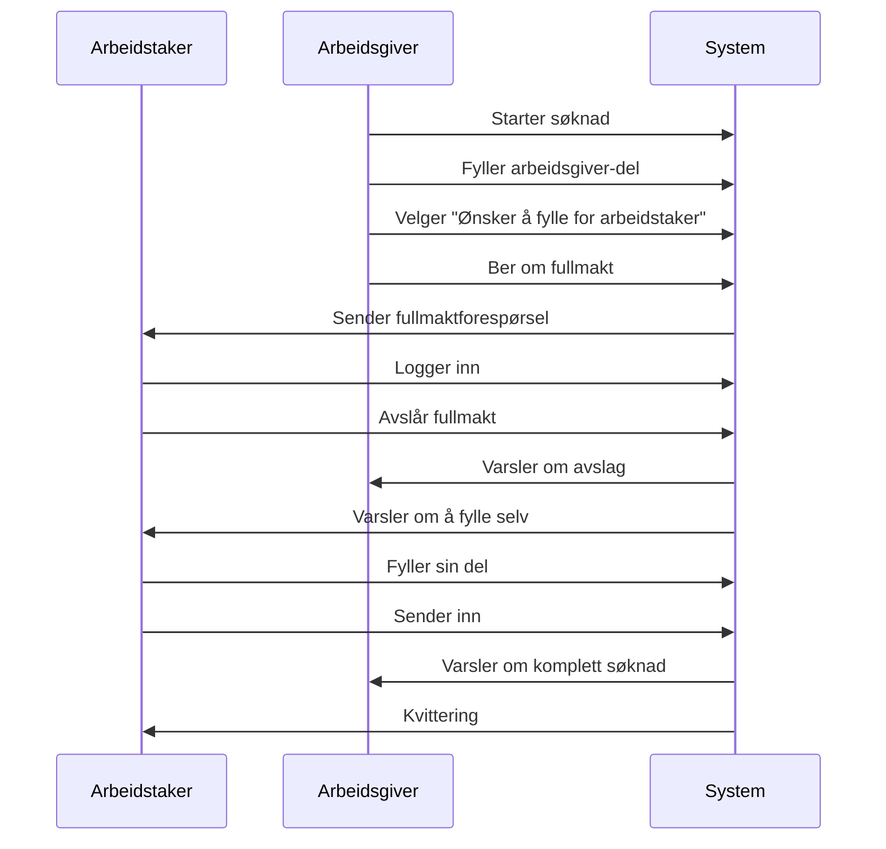
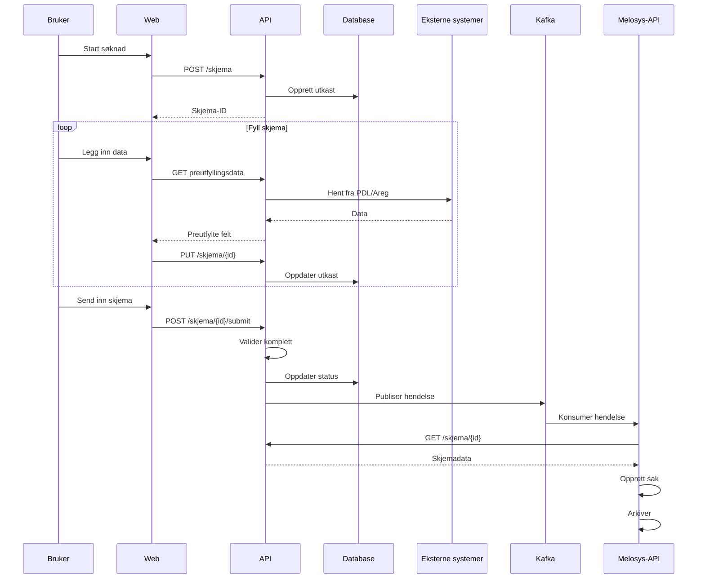
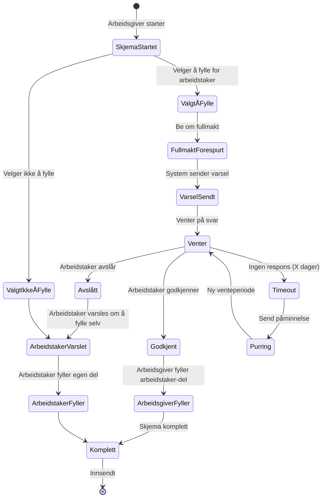
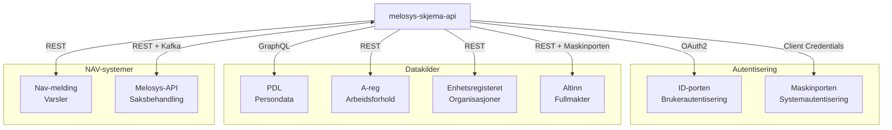
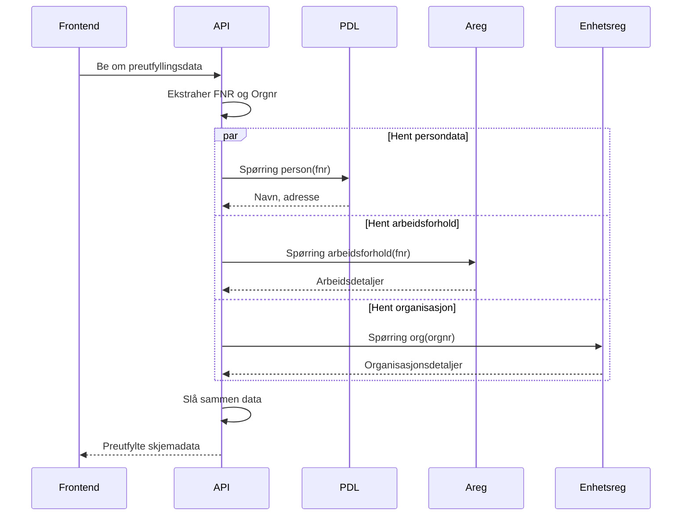
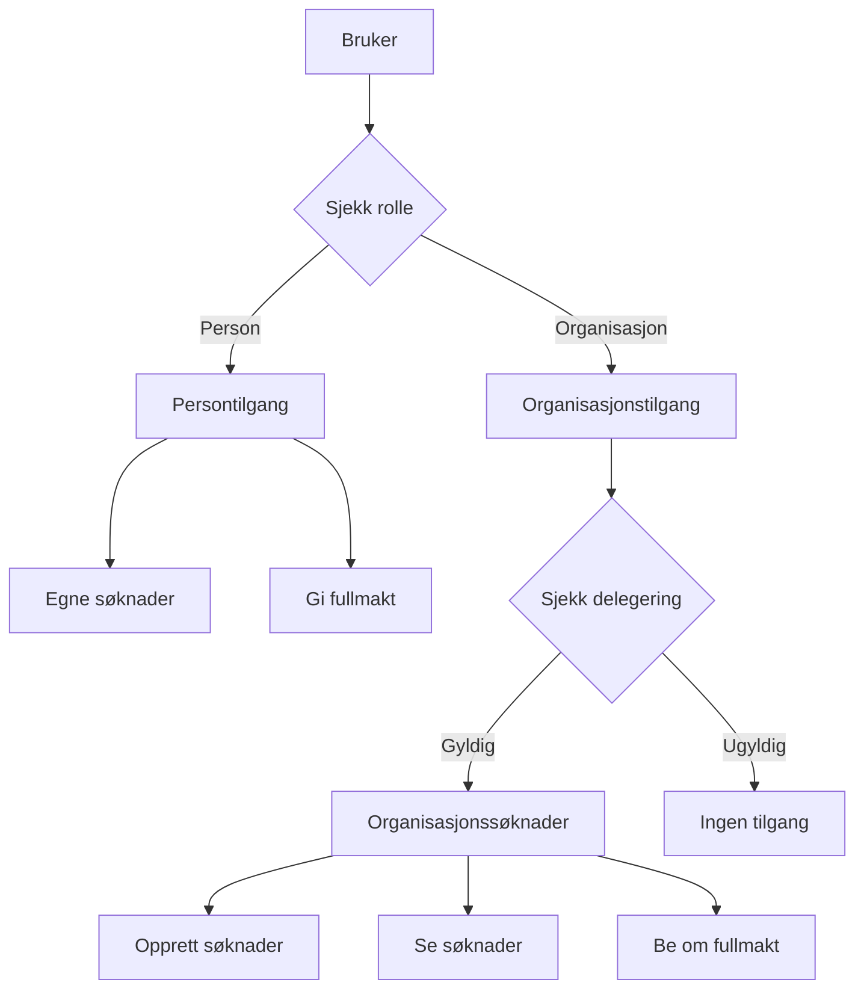

# Melosys Skjema - Komplett systemdokumentasjon

## Innholdsfortegnelse
1. [Oversikt](#1-oversikt)
2. [Systemarkitektur](#2-systemarkitektur)
3. [Komponenter](#3-komponenter)
4. [Brukerflyter](#4-brukerflyter)
5. [Dataflyt og prosesser](#5-dataflyt-og-prosesser)
6. [Integrasjoner](#6-integrasjoner)
7. [Sikkerhet og autorisering](#7-sikkerhet-og-autorisering)
8. [API Spesifikasjon](#8-api-spesifikasjon)
9. [Åpne punkter og avklaringer](#9-åpne-punkter-og-avklaringer)
10. [Vedlegg](#10-vedlegg)
11. [Epic, stories og oppgaver](oppgaver.md)

---

## 1. Oversikt

### 1.1 Bakgrunn
Team MELOSYS skal erstatte eksisterende Altinn-skjema for "Utsendt arbeidstaker" med en moderne løsning på Nav.no. Altinn går over til versjon 3, og det er strategisk bedre å bygge løsningen på Nav.no i tråd med NAVs kanalstrategi.

### 1.2 Formål
Systemet håndterer søknader om lovvalgsavklaring for utsendte arbeidstakere innen EU/EØS (artikkel 12 i forordningen).

I første omgang skal det håndtere søknader for arbeidstakere som sendes ut av norske arbeidsgivere til EU/EØS-land. Systemet skal støtte både arbeidsgivere og arbeidstakere i prosessen, inkludert fullmakter for rådgiverfirmaer. 

Resten av dokumentasjonen vil ta utgangspunkt i A1-skjema, men vil være utvidbart til andre skjemaer i fremtiden.

### 1.3 Hovedfunksjoner
- ✅ **Digital innsending** for arbeidsgivere og arbeidstakere (uavhengig av hverandre)
- ✅ **Fullmakthåndtering** mellom ulike parter (per søknad)
- ✅ **Rådgiverfirma-støtte** som kan opptre på vegne av arbeidsgivere via Altinn-delegering
- ✅ **Automatisk journalføring** når arbeidstaker sender inn sin del
- ✅ **Status-sporing** for alle parter på oversiktssiden
- ✅ **PDF-generering** av innsendte søknader

### 1.4 Målgrupper

| Brukergruppe | Beskrivelse | Hovedbehov |
|--------------|-------------|------------|
| **Arbeidstakere** | Personer som sendes ut for arbeid i EU/EØS | Fylle ut søknad, gi fullmakt, følge status |
| **Arbeidsgivere** | Norske bedrifter som sender ut arbeidstakere | Søke digitalt, håndtere flere arbeidstakere |
| **Rådgiverfirmaer** | Firmaer som bistår med søknadsprosessen | Håndtere mange klienter effektivt |
| **Saksbehandlere** | NAV-ansatte som behandler søknader | Motta strukturerte søknader automatisk |

### 1.5 Volum og skalering
- **Initialt volum**: 10+ søknader per dag
- **Fremtidig vekst**: Planlagt utvidelse til flere skjematyper
- **Skalerbarhet**: Designet for å håndtere betydelig vekst

---

## 2. Systemarkitektur

### 2.1 Overordnet arkitektur



### 2.2 Tech-stack

| Lag | Teknologi    | Versjon  | Formål                |
|-----|--------------|----------|-----------------------|
| **Frontend** | React        | 19.x     | UI-rammeverk          |
| **Frontend** | TypeScript   | 5.9.x    | Typesikkerhet         |
| **Frontend** | Node.js      | 22.x LTS | JavaScript runtime    |
| **Frontend** | Express.js   | 5.x      | Proxy-server          |
| **Frontend** | NAV Aksel    | Siste    | Designsystem          |
| **Frontend** | Vitest       | 1.0.x    | Enhetstesting         |
| **Frontend** | Playwright   | 1.35.x   | End-to-end testing    |
| **Frontend** | Unleash      | -        | Feature toggling      |
| **Backend** | Spring Boot  | 3.5.x    | Applikasjonsrammeverk |
| **Backend** | Kotlin       | 2.2.x    | Programmeringsspråk   |
| **Backend** | JPA/Hibernate | 6.x      | ORM for database      |
| **Backend** | Flyway       | 11.x     | Database migrering    |
| **Backend** | Unleash      | -        | Feature toggling      |
| **Database** | PostgreSQL   | 17.x     | Datalagring           |
| **Meldingskø** | Kafka        | 3.9.x    | Hendelsesstrøm        |
| **Plattform** | NAIS         | -        | Kubernetes-plattform  |

### 2.3 Deployment

Systemet deployes automatisk via GitHub Actions til NAIS-plattformen:

- **Dev-miljø**: Automatisk deploy ved push til `main`-branch
- **Prod-miljø**: Deploy ved publisering av ny release på GitHub

Begge miljøer kjører på NAIS med følgende oppsett:
- Docker-images bygges og pushes til Google Artifact Registry (GAR)
- Deployment til NAIS cluster via `nais/deploy` action
- Automatisk database-migrering med Flyway
- Unleash for feature toggles
- Automatisk Slack-varsling ved deploy

---

## 3. Komponenter

### 3.1 melosys-skjema-web (Frontend)

#### 3.1.1 Hovedansvar
- Brukergrensesnitt for alle brukergrupper
- Autentisering via ID-porten
- Utfylling av skjema
- Oversiktsside
- Skjemavalidering på klient-siden
- Representasjonsvalg
- PDF-visning og nedlasting (kanskje)

#### 3.1.2 Sidestruktur - A1-flyt



**Viktige prinsipper:**
- Arbeidstaker og arbeidsgiver kan sende sine deler uavhengig av hverandre
- Arbeidsgiver må oppgi arbeidstaker som del av søknaden
- Arbeidsgiver får aktivt valg om de ØNSKER å fylle inn på vegne av arbeidstaker
- Fullmakt gjelder kun for én spesifikk søknad
- Journalføring starter når arbeidstaker sender inn sin del

### 3.2 melosys-skjema-api (Backend)

#### 3.2.1 Hovedansvar
- REST API for frontend
- Validering og forretningslogikk
- Integrasjon med eksterne systemer
- Kafka hendelsespublisering
- Datapersistering

#### 3.2.2 Tjenestekomponenter

| Komponent | Ansvar |
|-----------|--------|
| **SoknadService** | CRUD-operasjoner for søknader |
| **ValidationService** | Forretningsregelvalidering |
| **IntegrationService** | Eksterne systemintegrasjoner |
| **FullmaktService** | Fullmakthåndtering |
| **NotificationService** | Brukervarsler |
| **PDFService** | PDF-generering |

### 3.3 Database

#### 3.3.1 Hovedtabeller

> **✅ Besluttet:** Fullmakt per skjemainstans

| Tabell | Beskrivelse | Nøkkelfelt |
|--------|-------------|------------|
| **skjema** | Skjemaer | id, status, type, fnr, orgnr |
| **fullmakt** | Fullmakter | id, skjema_id, status, gyldig_fra, gyldig_til |
| **vedlegg** | Vedlegg | id, skjema_id, filnavn, storage_url |

*Fullmakt gjelder kun for én spesifikk søknad og er ikke overførbar til andre søknader.*

---

## 4. Brukerflyter

### 4.1 Hovedflyt - Arbeidsgiver med fullmakt

> **Viktige prinsipper:**
> - Arbeidstaker og arbeidsgiver kan sende sin del uavhengig av hverandre (men arbeidsgiver må først oppgi arbeidstaker som en del av søknaden)
> - Arbeidsgiver skal få spørsmål om de ØNSKER å fylle inn på vegne av bruker:
>   - Hvis de velger å fylle inn, må de som nevnt i grafen, spørre om fullmakt
>   - Hvis de velger å ikke fylle inn på vegne av arbeidstaker, sendes det varsel til arbeidstaker om å fylle inn sin del (uten fullmakt-logikken)

### 4.2 Alternativ flyt - Arbeidstaker fyller selv

> **Viktig:** Se fullmakt.md for detaljerte fullmaktscenarioer



**Alternativ med fullmakt:**



### 4.3 Rådgiverfirma - flyt

Når en bruker velger en bedrift de har tilgang til, opererer de som om de er den bedriften og kan dermed gå gjennom samme flyten som beskrevet over.

---

## 5. Dataflyt og prosesser

### 5.1 Søknadsprosess - Komplett flyt



### 5.2 Fullmaktprosess



### 5.3 Skjemastatus

**Skjemastatuser:**
- `UTKAST` - Skjema opprettet, ikke ferdig utfylt
- `SENDT` - Skjema sendt inn av bruker
- `MOTTATT` - Skjema mottatt og journalført i NAV

**Fullmaktstatuser:**
- `VENTER` - Venter på svar fra arbeidstaker (timeout: 30 dager foreslått)
- `GODKJENT` - Arbeidstaker har godkjent fullmakt
- `AVSLÅTT` - Arbeidstaker har avslått fullmakt

**Journalføring:**
- Starter når arbeidstaker sender inn sin del (juridisk krav)
- Skjer uavhengig av om arbeidsgiver har sendt sin del

---

## 6. Integrasjoner

### 6.1 Eksterne systemer



### 6.2 Integrasjonsdetaljer

| System | Type | Autentisering | Formål |
|--------|------|---------------|--------|
| **ID-porten** | OAuth2 | Public client | Brukerautentisering (Nivå 4) |
| **Maskinporten** | OAuth2 | Client credentials | System-til-system autentisering |
| **Altinn** | REST | Maskinporten token | Hente fullmakter/representasjoner |
| **PDL** | GraphQL | Systembruker | Persondata (navn, adresse) |
| **A-reg** | REST | Systembruker | Arbeidsforholdsinformasjon |
| **Enhetsregisteret** | REST | Åpen API | Organisasjonsdata |
| **Nav-melding** | REST | Systembruker | Sende varsler |
| **Melosys-API** | REST + Kafka | Intern | Saksbehandling |

### 6.3 Integrasjonsflyt - eksempel - preutfylling



---

## 7. Sikkerhet og autorisering

### 7.1 Autorisasjonsmodell

> **Se fullmakt.md for komplett dokumentasjon av fullmaktmodellen**



---

## 8. API Spesifikasjon

### 8.1 REST Endepunktoversikt

| Metode | Endepunkt | Beskrivelse | Auth påkrevd |
|--------|-----------|-------------|--------------|
| **Autentisering** | | | |
| GET | /auth/representasjoner | Hent brukers organisasjoner | Ja |
| **Skjemaer** | | | |
| GET | /skjema | List skjemaer | Ja |
| POST | /skjema | Opprett nytt skjema | Ja |
| GET | /skjema/{id} | Hent spesifikt skjema | Ja |
| PUT | /skjema/{id} | Oppdater skjema | Ja |
| DELETE | /skjema/{id} | Slett utkast | Ja |
| POST | /skjema/{id}/submit | Send inn skjema | Ja |
| GET | /skjema/{id}/pdf | Generer PDF | Ja |
| **Fullmakt** | | | |
| POST | /fullmakt | Be om fullmakt | Ja |
| GET | /fullmakt/{id} | Hent fullmaktdetaljer | Ja |
| POST | /fullmakt/{id}/godkjenn | Godkjenn fullmakt | Ja |
| POST | /fullmakt/{id}/avslag | Avslå fullmakt | Ja |
| **Preutfyllingsdata** | | | |
| POST | /preutfyll/person | Hent persondata | Ja |
| GET | /preutfyll/org/{orgnr} | Hent organisasjonsdata | Ja |

### 8.2 Kafka-hendelser

| Hendelse | Topic | Beskrivelse | Konsumenter |
|----------|-------|-------------|-------------|
| SKJEMA_INNSENDT | melosys.soknad.innsendt | Nytt skjema innsendt med type og metadata | melosys-api |

---

## 9. Åpne punkter og avklaringer

### 9.1 Funksjonelle avklaringer

| ID | Kategori | Beskrivelse | Status | Eier |
|----|----------|-------------|--------|------|
| F01 | 🔑 Fullmakt | Hvem får fullmakt når rådgiverfirma ber om det? | 🟡 Under avklaring | Produkteier |
| F02 | ⏱️ Timeout | 30 dager foreslått - må bekreftes | 🟡 Under avklaring | Produkteier |
| F03 | 🔔 Purring | Automatiske påminnelser - antall og timing? | 🔴 Ikke startet | Produkteier |
| F04 | 📧 Kvittering | Er Nav.no standard kvittering juridisk tilstrekkelig? | 🟡 Under avklaring | Juridisk |
| F05 | 🗑️ GDPR | Sletteregler for persondata | 🔴 Ikke startet | Juridisk |

### 9.2 Tekniske avklaringer

| ID | Kategori | Beskrivelse | Status | Eier |
|----|----------|-------------|--------|------|
| T01 | 📄 PDF | Hvilken tjeneste for PDF-generering? | 🔴 Ikke startet | Arkitektur |
| T02 | 📊 Monitoring | Grafana dashboards oppsett | 🔴 Ikke startet | DevOps |

---

## 10. Vedlegg

### 10.1 Ordliste

| Term | Forklaring |
|------|------------|
| **A1** | Portable Document A1 - bekreftelse på trygdetilhørighet for arbeid i EU/EØS |
| **Arbeidstaker** | Person som sendes ut for arbeid i annet EU/EØS-land |
| **Arbeidsgiver** | Norsk virksomhet som sender ut arbeidstaker |
| **EØS** | Det europeiske økonomiske samarbeidsområde |
| **Fullmakt** | Tillatelse til å handle på vegne av noen andre |
| **Fullmektig** | Person eller organisasjon som har mottatt fullmakt |
| **Melosys** | NAVs fagsystem for medlemskap og lovvalg |
| **NAIS** | NAVs application infrastructure service (Kubernetes-plattform) |
| **Rådgiverfirma** | Konsulentfirma som bistår bedrifter med søknadsprosesser |
| **TokenX** | Token exchange service for zero trust-arkitektur |
| **Utsending** | Midlertidig arbeid i annet EØS-land med norsk trygdedekning |

### 10.2 Referanser

#### Interne dokumenter
- [Elektronisk søknadsdialog på Altinn - Confluence](https://confluence.adeo.no/spaces/TEESSI/pages/340512270/)
- [Overordnet arkitekturskisse](https://confluence.adeo.no/spaces/TEESSI/pages/514152970/)
- [Mottak søknad fra Altinn](https://confluence.adeo.no/spaces/TEESSI/pages/377698427/)

#### Eksterne ressurser
- [NAV Design System (Aksel)](https://aksel.nav.no)
- [NAIS Dokumentasjon](https://doc.nais.io)
- [ID-porten](https://docs.digdir.no/docs/idporten/)
- [Altinn Platform](https://docs.altinn.studio/)

#### Lover og forskrifter
- [eForvaltningsforskriften](https://lovdata.no/dokument/SF/forskrift/2004-06-25-988)
- [Forordning 883/2004](https://eur-lex.europa.eu/legal-content/EN/TXT/?uri=CELEX:32004R0883)
- [GDPR](https://gdpr.eu)

### 10.3 Kontaktinformasjon

| Rolle | Team/Person | Kontaktkanal | Ansvar |
|-------|-------------|--------------|--------|
| Produkteier | Kristin | Slack: #team-melosys | Funksjonelle krav og prioritering |
| Tech Lead | Øystein | Slack: #team-melosys | Teknisk arkitektur og beslutninger |
| UX Designer | Øyvind | Slack: #team-melosys | Brukeropplevelse og design |
| Altinn-kontakt | Dana | Slack | Altinn-integrasjon og support |
| DevOps | NAIS team | Slack: #nais | Infrastruktur og plattform |

### 10.4 Miljøer og URLer

| Miljø | Type | URL | Formål |
|-------|------|-----|--------|
| **Utvikling** | | | |
| Frontend Dev | Dev | https://melosys-skjema.dev.nav.no | Utvikling |
| API Dev | Dev | https://melosys-skjema-api.dev.nav.no | Backend-utvikling |
| **Test** | | | |
| Frontend Test | Test | https://melosys-skjema.ekstern.dev.nav.no | Ekstern testing |
| API Test | Test | https://melosys-skjema-api.dev.nav.no | API-testing |
| **Produksjon** | | | |
| Frontend Prod | Prod | https://nav.no/skjema/melosys | Produksjon |
| API Prod | Prod | https://melosys-skjema-api.intern.nav.no | Produksjon API |

---

## Epic, stories og oppgaver

For detaljert oversikt over utviklingsoppgaver, brukerhistorier og epics, se [oppgaver.md](oppgaver.md). Dette dokumentet inneholder:
- Overordnede epics for prosjektet
- Brukerhistorier (user stories) med akseptansekriterier
- Tekniske oppgaver og implementasjonsdetaljer
- Prioritering og estimater

## Fullmaktmodell

For detaljert dokumentasjon av fullmaktmodellen, se [fullmakt.md](fullmakt.md). Dette dokumentet inneholder:
- Alle fullmaktscenarioer med diagrammer
- Tilgangskontroll-matrise
- Tekniske beslutninger og avklaringer
- Kommunikasjonstips for teamet

---

## Utviklerdokumentasjon

### Kjøre APIet lokalt mot ekte q1 og q2 miljø

For å kjøre APIet lokalt med tilkobling til ekte Q1 eller Q2 miljøer:

#### Forutsetninger
- `kubectl` konfigurert mot riktig cluster
- `gcloud` CLI installert og logget inn med `gcloud auth login --update-adc`
- Databasetilkobling via `nais postgres proxy melosys-skjema-api`

#### Engangsoppsett
```bash
chmod +x scripts/*.sh
```

#### Kjøring
```bash
# For Q1-miljø
./gradlew bootRun --args='--spring.profiles.active=local-q1'

# For Q2-miljø  
./gradlew bootRun --args='--spring.profiles.active=local-q2'
```

Ved oppstart vil applikasjonen automatisk:
- Hente TokenX secrets fra Kubernetes via `scripts/get-tokenx-private-jwk.sh`
- Hente din gcloud account via `scripts/get-gcloud-account.sh` for database-tilkobling
- Koble til lokal PostgreSQL database med din gcloud bruker som username

### Kjøre APIet mot lokalt miljø

#### Forutsetninger

- Kjører containerne docker-compose, nyeste master, i [melosys-docker-compose](https://github.com/navikt/melosys-docker-compose)
- Har kjørt opp docker-compose i dette prosjektet.

#### Kjøring
```bash
# Start applikasjonen med lokal profil
./gradlew bootRun --args='--spring.profiles.active=local'
```

#### Generere test-tokens
For å teste endpoints som krever autentisering:

```bash
# Generer token med standard PID (12345678910)
./scripts/get-local-access-token.sh

# Generer token med custom PID
./scripts/get-local-access-token.sh 09876543210
```

Scriptet vil:
- Generere en JWT token fra MockOAuth2Server
- Inkludere claims som `pid`, `azp` og `expiry`
- Kopiere token til clipboard
- Token er gyldig i 1 time

---

*Dette er et levende dokument som oppdateres kontinuerlig gjennom prosjektets levetid.*