```mermaid
sequenceDiagram
    participant Frontend
    participant API
    participant PDL
    participant Areg
    participant Enhetsreg
    
    Frontend->>API: Be om preutfyllingsdata
    API->>API: Ekstraher FNR og Orgnr
    
    par Hent persondata
        API->>PDL: Spørring person(fnr)
        PDL-->>API: Navn, adresse
    and Hent arbeidsforhold
        API->>Areg: Spørring arbeidsforhold(fnr)
        Areg-->>API: Arbeidsdetaljer
    and Hent organisasjon
        API->>Enhetsreg: Spørring org(orgnr)
        Enhetsreg-->>API: Organisasjonsdetaljer
    end
    
    API->>API: Slå sammen data
    API-->>Frontend: Preutfylte skjemadata
```

# Melosys Skjema - Komplett systemdokumentasjon

## Innholdsfortegnelse
1. [Oversikt](#1-oversikt)
2. [Systemarkitektur](#2-systemarkitektur)
3. [Komponenter](#3-komponenter)
4. [Brukerflyter](#4-brukerflyter)
5. [Dataflyt og Prosesser](#5-dataflyt-og-prosesser)
6. [Integrasjoner](#6-integrasjoner)
7. [Sikkerhet og Autorisering](#7-sikkerhet-og-autorisering)
8. [Database Design](#8-database-design)
9. [API Spesifikasjon](#9-api-spesifikasjon)
10. [Åpne Punkter og Avklaringer](#10-åpne-punkter-og-avklaringer)
11. [Vedlegg](#11-vedlegg)

---

## 1. Oversikt

### 1.1 Bakgrunn
Team MELOSYS skal erstatte eksisterende Altinn-skjema for "Utsendt arbeidstaker" med en moderne løsning på Nav.no. Altinn går over til versjon 3, og det er strategisk bedre å bygge løsningen på Nav.no i tråd med NAVs kanalstrategi.

### 1.2 Formål
Systemet håndterer søknader om lovvalgsavklaring for utsendte arbeidstakere innen EU/EØS (artikkel 12 i forordningen).

I første omgang skal det håndtere søknader for arbeidstakere som sendes ut av norske arbeidsgivere til EU/EØS-land. Systemet skal støtte både arbeidsgivere og arbeidstakere i prosessen, inkludert fullmakter for rådgiverfirmaer.

### 1.3 Hovedfunksjoner
- ✅ **Digital innsending** for arbeidsgivere
- ✅ **Fullmakthåndtering** mellom arbeidsgiver og arbeidstaker
- ✅ **Rådgiverfirma-støtte** som kan opptre på vegne av arbeidsgivere
- ✅ **Automatisk journalføring** og saksopprettelse
- ✅ **Status-sporing** for alle parter
- ✅ **PDF-generering** av innsendte søknader

### 1.4 Målgrupper

| Brukergruppe | Beskrivelse | Hovedbehov |
|--------------|-------------|------------|
| **Arbeidstakere** | Personer som sendes ut for arbeid i EU/EØS | Fylle ut søknad, gi fullmakt, følge status |
| **Arbeidsgivere** | Norske bedrifter som sender ut arbeidstakere | Søke digitalt, håndtere flere arbeidstakere |
| **Rådgiverfirmaer** | Firmaer som bistår med søknadsprosessen | Håndtere mange klienter effektivt |
| **Saksbehandlere** | NAV-ansatte som behandler søknader | Motta strukturerte søknader automatisk |

### 1.5 Volum og Skalering
- **Initialt volum**: 10+ søknader per dag
- **Fremtidig vekst**: Planlagt utvidelse til flere skjematyper
- **Skalerbarhet**: Designet for å håndtere betydelig vekst

---

## 2. Systemarkitektur

### 2.1 Overordnet Arkitektur

### 2.2 Teknisk Stack

| Lag | Teknologi | Versjon | Formål |
|-----|-----------|---------|--------|
| **Frontend** | React | 18.x | UI-rammeverk |
| **Frontend** | TypeScript | 5.x | Typesikkerhet |
| **Frontend** | Node m/ express.js | 5.x | Proxy-server |
| **Frontend** | NAV Aksel | Siste | Designsystem |
| **Backend** | Spring Boot | 3.2.x | Applikasjonsrammeverk |
| **Backend** | Kotlin | 1.9.x | Programmeringsspråk |
| **Database** | PostgreSQL | 15.x | Datalagring |
| **Meldingskø** | Kafka | 3.x | Hendelsesstrøm |
| **Plattform** | NAIS | - | Kubernetes-plattform |

### 2.3 Deployment
Gjøre som resten av Team Melosys sine apper.

---

## 3. Komponenter

### 3.1 melosys-skjema-web (Frontend)

#### 3.1.1 Hovedansvar
- Brukergrensesnitt for alle brukergrupper
- Autentisering via ID-porten
- Utfylling av skjema
- Oversiktsside
- Skjemavalidering på klient-siden
- Representasjonsvalg
- PDF-visning og nedlasting (kanskje)

#### 3.1.2 Sidestruktur - A1-flyt

```mermaid
graph TD
    Landing[Landingsside] --> Auth{Autentisert?}
    Auth -->|Nei| Login[ID-porten innlogging]
    Auth -->|Ja| RoleSelect[Rollevalg]
    
    RoleSelect --> PersonDash[Person-oversikt]
    RoleSelect --> OrgDash[Organisasjon-oversikt]
    
    PersonDash --> MyApps[Mine skjemaer]
    PersonDash --> Fullmakt[Fullmaktbeslutninger]
    
    OrgDash --> NewApp[Ny søknad]
    OrgDash --> AppList[Søknadsliste]
    
    NewApp --> EmployerForm[Arbeidsgiver-skjema]
    
    EmployerForm --> PowerChoice{Ønsker å fylle<br/>arbeidstaker-del?}
    PowerChoice -->|Ja| RequestPower[Be om fullmakt]
    PowerChoice -->|Nei| NotifyEmployee[Varsle arbeidstaker]
    
    RequestPower --> WaitPower{Venter på svar}
    WaitPower -->|Godkjent| EmployeeForm[Arbeidstaker-skjema]
    WaitPower -->|Avslått| NotifyEmployee
    
    EmployeeForm --> Review[Gjennomgang og send inn]
    
    PersonDash -.->|Arbeidstaker-del| EmployeeForm
```

**Viktige prinsipper:**
- Arbeidstaker og arbeidsgiver kan sende sine deler uavhengig av hverandre
- Arbeidsgiver må oppgi arbeidstaker som del av søknaden
- Arbeidsgiver får aktivt valg om de ønsker å fylle inn på vegne av arbeidstaker

### 3.2 melosys-skjema-api (Backend)

#### 3.2.1 Hovedansvar
- REST API for frontend
- Validering og forretningslogikk
- Integrasjon med eksterne systemer
- Kafka hendelsespublisering
- Datapersistering

#### 3.2.2 Tjenestekomponenter

| Komponent | Ansvar |
|-----------|--------|
| **SoknadService** | CRUD-operasjoner for søknader |
| **ValidationService** | Forretningsregelvalidering |
| **IntegrationService** | Eksterne systemintegrasjoner |
| **FullmaktService** | Fullmakthåndtering |
| **NotificationService** | Brukervarsler |
| **PDFService** | PDF-generering |

### 3.3 Database

#### 3.3.1 Hovedtabeller

> **📌 Avklaring påkrevd:** Fullmaktmodell må bestemmes før implementering

**Alternativ 1: Fullmakt per skjemainstans (anbefalt)**

| Tabell | Beskrivelse | Nøkkelfelt |
|--------|-------------|------------|
| **skjema** | Skjemaer | id, status, type, fnr, orgnr |
| **fullmakt** | Fullmakter | id, skjema_id, status, gyldig_fra, gyldig_til |
| **vedlegg** | Vedlegg | id, skjema_id, filnavn, storage_url |

**Alternativ 2: Fullmakt per skjematype**

| Tabell | Beskrivelse | Nøkkelfelt |
|--------|-------------|------------|
| **skjema** | Skjemaer | id, status, type, fnr, orgnr, opprettet_dato, endret_dato |
| **fullmakt** | Fullmakter | id, fnr, orgnr, skjematype, status, gyldig_fra, gyldig_til |
| **pdf** | PDF-er | id, skjema_id, filnavn, storage_url |

*Anbefaling: Alternativ 1 gir bedre sikkerhet og krever ikke tilbaketrekking av fullmakt.*

---

## 4. Brukerflyter

### 4.1 Hovedflyt - Arbeidsgiver med Fullmakt

TODO:
- Arbeidstaker og arbeidsgiver kan sende sin del uavhengigh av hverandre (men arbeidsgiver må først oppgi arbeidstaker som en del av søknaden)
- Arbeidsgiver skal få spørsmål om de ØNSKER å fylle inn på vegne av bruker.
    - Hvis de velger å fylle inn, må de som nevnt i grafen, spørre om fullmakt
    - Hvis de velger å ikke fylle inn på vegne av arbeidstaker, sendes det varsel til arebidstaker om å fylle inn sin del (uten fullmakt-logikken).

### 4.2 Alternativ Flyt - Arbeidstaker Fyller Selv

```mermaid
sequenceDiagram
    participant AT as Arbeidstaker
    participant AG as Arbeidsgiver
    participant System as System
    
    AG->>System: Starter søknad
    AG->>System: Fyller arbeidsgiver-del
    AG->>System: Velger "Ikke fyll for arbeidstaker"
    System->>AT: Sender varsel om å fylle sin del
    
    Note over AT,AG: Uavhengig utfylling
    
    AT->>System: Logger inn
    AT->>System: Fyller sin del
    AT->>System: Sender inn sin del
    
    AG->>System: Kan sende sin del når som helst
    
    System->>System: Når begge deler er mottatt
    System->>AG: Varsler om komplett søknad
    System->>AT: Kvittering på komplett søknad
```

**Alternativ med fullmakt:**

```mermaid
sequenceDiagram
    participant AT as Arbeidstaker
    participant AG as Arbeidsgiver
    participant System as System
    
    AG->>System: Starter søknad
    AG->>System: Fyller arbeidsgiver-del
    AG->>System: Velger "Ønsker å fylle for arbeidstaker"
    AG->>System: Ber om fullmakt
    System->>AT: Sender fullmaktforespørsel
    
    AT->>System: Logger inn
    AT->>System: Avslår fullmakt
    System->>AG: Varsler om avslag
    System->>AT: Varsler om å fylle selv
    
    AT->>System: Fyller sin del
    AT->>System: Sender inn
    
    System->>AG: Varsler om komplett søknad
    System->>AT: Kvittering
```

### 4.3 Rådgiverfirma Flyt

Når en bruker velger en bedrift de har tilgang til, opererer de som om de er den bedriften og kan dermed gå gjennom samme flyten som beskrevet over.

---

## 5. Dataflyt og Prosesser

### 5.1 Søknadsprosess - Komplett Flyt

```mermaid
sequenceDiagram
    participant B as Bruker
    participant W as Web
    participant A as API
    participant DB as Database
    participant E as Eksterne systemer
    participant K as Kafka
    participant M as Melosys-API
    
    B->>W: Start søknad
    W->>A: POST /api/v1/skjema
    A->>DB: Opprett utkast
    A-->>W: Skjema-ID
    
    loop Fyll skjema
        B->>W: Legg inn data
        W->>A: GET preutfyllingsdata
        A->>E: Hent fra PDL/Areg
        E-->>A: Data
        A-->>W: Preutfylte felt
        W->>A: PUT /api/v1/skjema/{id}
        A->>DB: Oppdater utkast
    end
    
    B->>W: Send inn skjema
    W->>A: POST /api/v1/skjema/{id}/submit
    A->>A: Valider komplett
    A->>DB: Oppdater status
    A->>K: Publiser hendelse
    K->>M: Konsumer hendelse
    M->>A: GET /api/v1/skjema/{id}
    A-->>M: Skjemadata
    M->>M: Opprett sak
    M->>M: Arkiver
```

### 5.2 Fullmaktprosess

```mermaid
stateDiagram-v2
    [*] --> SkjemaStartet: Arbeidsgiver starter
    
    SkjemaStartet --> ValgtÅFylle: Velger å fylle for arbeidstaker
    SkjemaStartet --> ValgtIkkeÅFylle: Velger ikke å fylle
    
    ValgtÅFylle --> FullmaktForespurt: Be om fullmakt
    FullmaktForespurt --> VarselSendt: System sender varsel
    
    VarselSendt --> Venter: Venter på svar
    
    Venter --> Godkjent: Arbeidstaker godkjenner
    Venter --> Avslått: Arbeidstaker avslår
    Venter --> Timeout: Ingen respons (X dager)
    
    Godkjent --> ArbeidsgiverFyller: Arbeidsgiver fyller arbeidstaker-del
    Avslått --> ArbeidstakerVarslet: Arbeidstaker varsles om å fylle selv
    ValgtIkkeÅFylle --> ArbeidstakerVarslet
    
    Timeout --> Purring: Send påminnelse
    Purring --> Venter: Ny venteperiode
    
    ArbeidsgiverFyller --> Komplett: Skjema komplett
    ArbeidstakerVarslet --> ArbeidstakerFyller: Arbeidstaker fyller egen del
    ArbeidstakerFyller --> Komplett
    
    Komplett --> [*]: Innsendt
```

### 5.3 Skjemastatus

**Skjemastatuser:**
- `UTKAST` - Skjema opprettet, ikke ferdig utfylt
- `SENDT` - Skjema sendt inn av bruker
- `MOTTATT` - Skjema mottatt og journalført i NAV

**Fullmaktstatuser:**
- `VENTER` - Venter på svar fra arbeidstaker
- `GODKJENT` - Arbeidstaker har godkjent fullmakt
- `AVSLÅTT` - Arbeidstaker har avslått fullmakt

---

## 6. Integrasjoner

### 6.1 Eksterne Systemer

### 6.2 Integrasjonsdetaljer

| System | Type | Autentisering | Formål |
|--------|------|---------------|--------|
| **ID-porten** | OAuth2 | Public client | Brukerautentisering (Nivå 4) |
| **Maskinporten** | OAuth2 | Client credentials | System-til-system autentisering |
| **Altinn** | REST | Maskinporten token | Hente fullmakter/representasjoner |
| **PDL** | GraphQL | Systembruker | Persondata (navn, adresse) |
| **A-reg** | REST | Systembruker | Arbeidsforholdsinformasjon |
| **Enhetsregisteret** | REST | Åpen API | Organisasjonsdata |
| **Nav-melding** | REST | Systembruker | Sende varsler |
| **Melosys-API** | REST + Kafka | Intern | Saksbehandling |

### 6.3 Integrasjonsflyt Eksempel - Preutfylling

---

## 7. Sikkerhet og Autorisering

### 7.1 Autorisasjonsmodell

```mermaid
graph TD
    Bruker[Bruker]
    
    Bruker --> SjekkRolle{Sjekk rolle}
    
    SjekkRolle -->|Person| PersonTilgang[Persontilgang]
    SjekkRolle -->|Organisasjon| OrgTilgang[Organisasjonstilgang]
    
    PersonTilgang --> EgneSoknader[Egne søknader]
    PersonTilgang --> GiFullmakt[Gi fullmakt]
    
    OrgTilgang --> SjekkDelegering{Sjekk delegering}
    SjekkDelegering -->|Gyldig| OrgSoknader[Organisasjonssøknader]
    SjekkDelegering -->|Ugyldig| IngenTilgang[Ingen tilgang]
    
    OrgSoknader --> OpprettSoknad[Opprett søknader]
    OrgSoknader --> SeSoknader[Se søknader]
    OrgSoknader --> BeOmFullmakt[Be om fullmakt]
```

---

## 9. API Spesifikasjon

### 9.1 REST Endepunkter Oversikt

| Metode | Endepunkt | Beskrivelse | Auth påkrevd |
|--------|-----------|-------------|--------------|
| **Autentisering** | | | |
| GET | /api/v1/auth/representasjoner | Hent brukers organisasjoner | Ja |
| **Skjemaer** | | | |
| GET | /api/v1/skjema | List skjemaer | Ja |
| POST | /api/v1/skjema | Opprett nytt skjema | Ja |
| GET | /api/v1/skjema/{id} | Hent spesifikt skjema | Ja |
| PUT | /api/v1/skjema/{id} | Oppdater skjema | Ja |
| DELETE | /api/v1/skjema/{id} | Slett utkast | Ja |
| POST | /api/v1/skjema/{id}/submit | Send inn skjema | Ja |
| GET | /api/v1/skjema/{id}/pdf | Generer PDF | Ja |
| **Fullmakt** | | | |
| POST | /api/v1/fullmakt | Be om fullmakt | Ja |
| GET | /api/v1/fullmakt/{id} | Hent fullmaktdetaljer | Ja |
| POST | /api/v1/fullmakt/{id}/godkjenn | Godkjenn fullmakt | Ja |
| POST | /api/v1/fullmakt/{id}/avslag | Avslå fullmakt | Ja |
| **Preutfyllingsdata** | | | |
| POST | /api/v1/prefill/person | Hent persondata | Ja |
| GET | /api/v1/prefill/org/{orgnr} | Hent organisasjonsdata | Ja |

### 9.2 Kafka-hendelser

| Hendelse | Topic | Beskrivelse | Konsumenter |
|----------|-------|-------------|-------------|
| SKJEMA_INNSENDT | melosys.soknad.innsendt | Nytt skjema innsendt med type og metadata | melosys-api |

---

## 10. Åpne Punkter og Avklaringer

### 10.1 Funksjonelle Avklaringer

| ID | Kategori | Beskrivelse | Status | Eier | Frist |
|----|----------|-------------|--------|------|-------|
| F01 | 🔑 Fullmakt | Skal fullmakt gjelde for én søknad eller periode? | 🟡 Under avklaring | Produkteier | 2024-02-01 |
| F02 | ⏱️ Timeout | Hvor lenge venter vi på respons fra arbeidstaker? | 🟡 Under avklaring | Produkteier | 2024-02-01 |
| F03 | 🔔 Purring | Automatiske påminnelser - antall og timing? | 🔴 Ikke startet | Produkteier | 2024-02-15 |
| F04 | 📧 Kvittering | Er Nav.no standard kvittering juridisk tilstrekkelig? | 🟡 Under avklaring | Juridisk | 2024-01-25 |
| F05 | 🗑️ GDPR | Sletteregler for persondata | 🔴 Ikke startet | Juridisk | 2024-03-01 |

### 10.2 Tekniske Avklaringer

| ID | Kategori | Beskrivelse | Status | Eier | Frist |
|----|----------|-------------|--------|------|-------|
| T01 | 📄 PDF | Hvilken tjeneste for PDF-generering? | 🔴 Ikke startet | Arkitektur | 2024-03-01 |
| T02 | 📊 Monitoring | Grafana dashboards oppsett | 🔴 Ikke startet | DevOps | 2024-06-01 |

---

## 11. Vedlegg

### 11.1 Ordliste

| Term | Forklaring |
|------|------------|
| **A1** | Portable Document A1 - bekreftelse på trygdetilhørighet for arbeid i EU/EØS |
| **Arbeidstaker** | Person som sendes ut for arbeid i annet EU/EØS-land |
| **Arbeidsgiver** | Norsk virksomhet som sender ut arbeidstaker |
| **EØS** | Det europeiske økonomiske samarbeidsområde |
| **Fullmakt** | Tillatelse til å handle på vegne av noen andre |
| **Fullmektig** | Person eller organisasjon som har mottatt fullmakt |
| **Melosys** | NAVs fagsystem for medlemskap og lovvalg |
| **NAIS** | NAVs application infrastructure service (Kubernetes-plattform) |
| **Rådgiverfirma** | Konsulentfirma som bistår bedrifter med søknadsprosesser |
| **TokenX** | Token exchange service for zero trust-arkitektur |
| **Utsending** | Midlertidig arbeid i annet EØS-land med norsk trygdedekning |

### 11.2 Referanser

#### Interne dokumenter
- [Elektronisk søknadsdialog på Altinn - Confluence](https://confluence.adeo.no/spaces/TEESSI/pages/340512270/)
- [Overordnet arkitekturskisse](https://confluence.adeo.no/spaces/TEESSI/pages/514152970/)
- [Mottak søknad fra Altinn](https://confluence.adeo.no/spaces/TEESSI/pages/377698427/)

#### Eksterne ressurser
- [NAV Design System (Aksel)](https://aksel.nav.no)
- [NAIS Dokumentasjon](https://doc.nais.io)
- [ID-porten](https://docs.digdir.no/docs/idporten/)
- [Altinn Platform](https://docs.altinn.studio/)

#### Lover og forskrifter
- [eForvaltningsforskriften](https://lovdata.no/dokument/SF/forskrift/2004-06-25-988)
- [Forordning 883/2004](https://eur-lex.europa.eu/legal-content/EN/TXT/?uri=CELEX:32004R0883)
- [GDPR](https://gdpr.eu)

### 11.3 Kontaktinformasjon

| Rolle | Team/Person | Kontaktkanal | Ansvar |
|-------|-------------|--------------|--------|
| Produkteier | Kristin | Slack: #team-melosys | Funksjonelle krav og prioritering |
| Tech Lead | Øystein | Slack: #team-melosys | Teknisk arkitektur og beslutninger |
| UX Designer | Øyvind | Slack: #team-melosys | Brukeropplevelse og design |
| Altinn-kontakt | Dana | Slack | Altinn-integrasjon og support |
| DevOps | NAIS team | Slack: #nais | Infrastruktur og plattform |

### 11.4 Miljøer og URLer

| Miljø | Type | URL | Formål |
|-------|------|-----|--------|
| **Utvikling** | | | |
| Frontend Dev | Dev | https://melosys-skjema.dev.nav.no | Utvikling |
| API Dev | Dev | https://melosys-skjema-api.dev.nav.no | Backend-utvikling |
| **Test** | | | |
| Frontend Test | Test | https://melosys-skjema.ekstern.dev.nav.no | Ekstern testing |
| API Test | Test | https://melosys-skjema-api.dev.nav.no | API-testing |
| **Produksjon** | | | |
| Frontend Prod | Prod | https://nav.no/skjema/melosys | Produksjon |
| API Prod | Prod | https://melosys-skjema-api.intern.nav.no | Produksjon API |

---

## Dokumenthistorikk

| Versjon | Dato | Forfatter | Endringer |
|---------|------|-----------|-----------|
| 1.0.0 | 2024-01-15 | Team Melosys | Initialversjon |
| 1.1.0 | 2024-11-08 | Team Melosys | Forenklet og fokusert dokumentasjon |

---

**Status**: 📝 Under utvikling  
**Sist oppdatert**: 2024-11-08  
**Neste gjennomgang**: 2024-02-01

*Dette er et levende dokument som oppdateres kontinuerlig gjennom prosjektets levetid.*