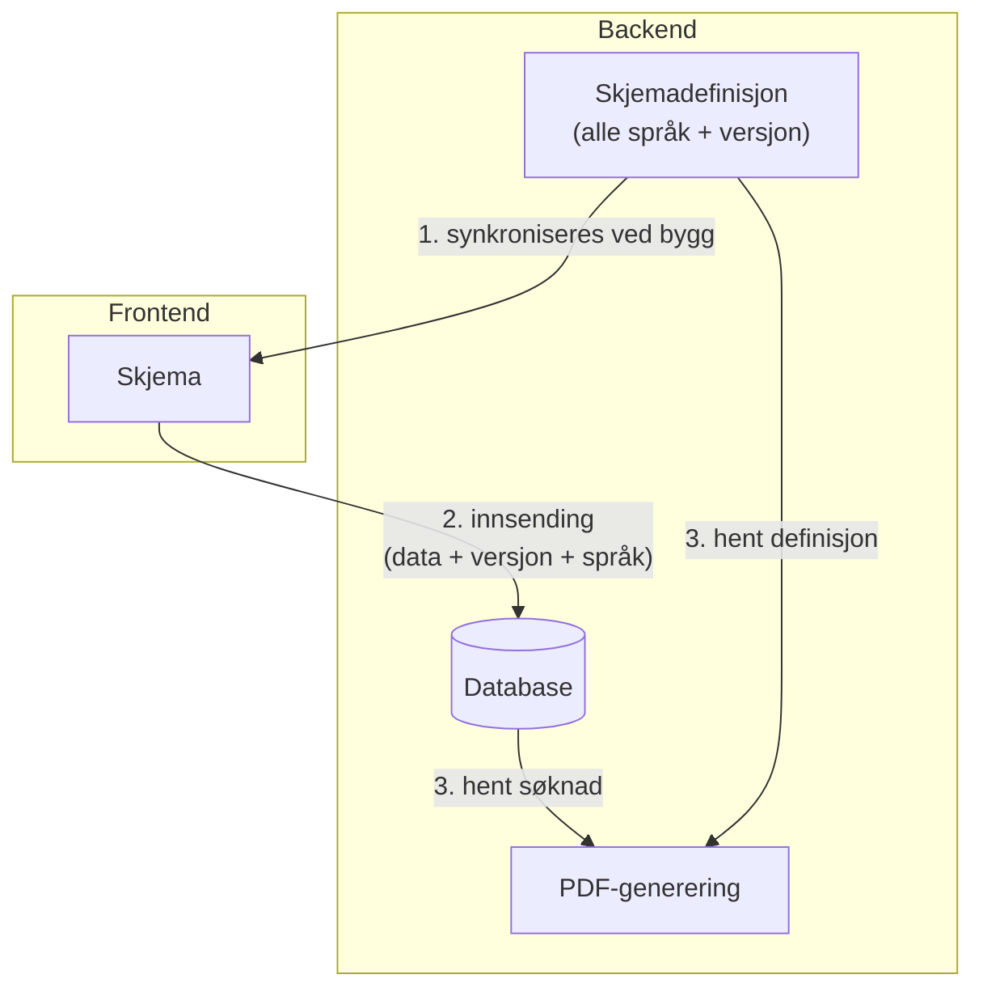

# ADR-001: Skjemadefinisjon med versjonering og flerspråklighet

## Status
Godkjent

## Kontekst

### Problemet
Når en bruker sender inn en søknad, mottar backend kun **data** (f.eks. `skattemessigBosatt: true`) - ikke konteksten om hvilket spørsmål brukeren faktisk så og besvarte.

Tekstene ("Er du skattemessig bosatt?") finnes bare i frontend sine i18n-filer. Dette skaper flere problemer:

1. **Etterlevelse**: Vi kan ikke dokumentere nøyaktig hva brukeren så da de fylte ut søknaden
2. **PDF-generering**: Backend kan ikke generere PDF med riktige tekster
3. **Visning av innsendte søknader**: Verken saksbehandler eller bruker kan se søknaden slik den ble fylt ut
4. **Endringer over tid**: Hvis skjematekster endres, mister vi historikken om hva tidligere søkere faktisk så

### Krav
- Innsendte søknader må kunne vises med **eksakt de tekstene brukeren så**
- Støtte for **flere språk** (bokmål, nynorsk, engelsk)
- **Versjonering** slik at endringer i skjemaet ikke påvirker visning av tidligere innsendinger

## Beslutning

Backend blir **single source of truth** for alle skjematekster og struktur.



### Hvordan det fungerer

1. **Skjemadefinisjon** lagres i backend som JSON med alle språk i én fil per versjon
2. **Frontend synkroniserer** definisjoner fra backend ved bygg (`npm run sync-skjema-definisjon`)
3. **Ved innsending** lagres hvilken versjon og språk brukeren brukte
4. **Ved visning** hentes den eksakte definisjonsversjonen som ble brukt

### Datamodell

**Innsending-tabell:**
```
skjema_definisjon_versjon  -- hvilken versjon av skjemaet
innsendt_sprak             -- hvilket språk brukeren valgte
```

**Skjemadefinisjon-fil** (`definisjon.json`):
```json
{
  "felter": {
    "skattemessigBosatt": {
      "label": { "nb": "Er du skattemessig bosatt?", "en": "Are you a tax resident?" },
      "jaLabel": { "nb": "Ja", "en": "Yes" },
      "neiLabel": { "nb": "Nei", "en": "No" }
    }
  }
}
```

## Konsekvenser

### Positive
- **Etterlevelse**: Kan alltid dokumentere nøyaktig hva brukeren så
- **Konsistens**: Frontend, PDF og søknadsvisning viser alltid samme tekster
- **Versjonering**: Endringer i skjema påvirker ikke tidligere innsendinger
- **Flerspråklighet**: Støtter flere språk med én kilde

### Negative
- Frontend må synkronisere ved bygg (ikke runtime)
- Større kompleksitet i datamodellen

## Relaterte filer
- `resources/skjema-definisjoner/{type}/{versjon}/definisjon.json`
- `SkjemaDefinisjonService.kt`
- `Innsending.kt` (lagrer versjon og språk)
