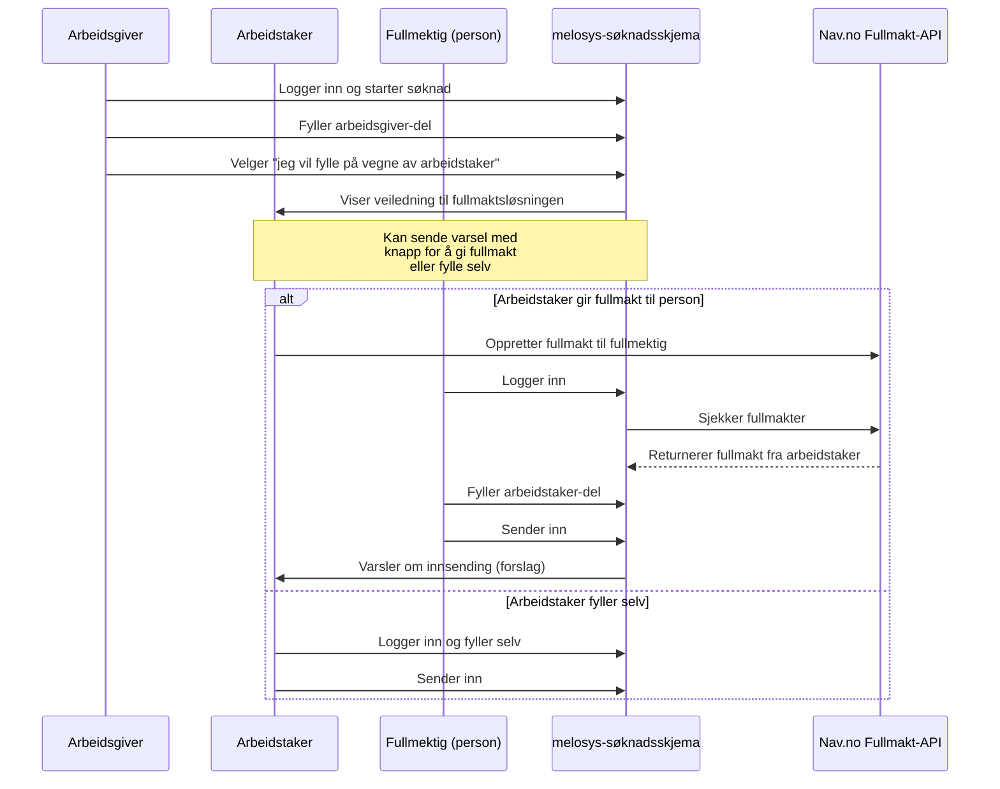
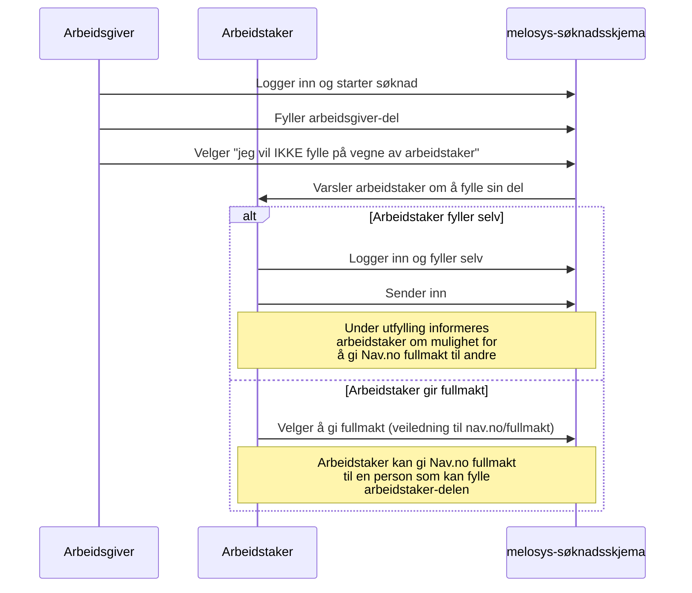
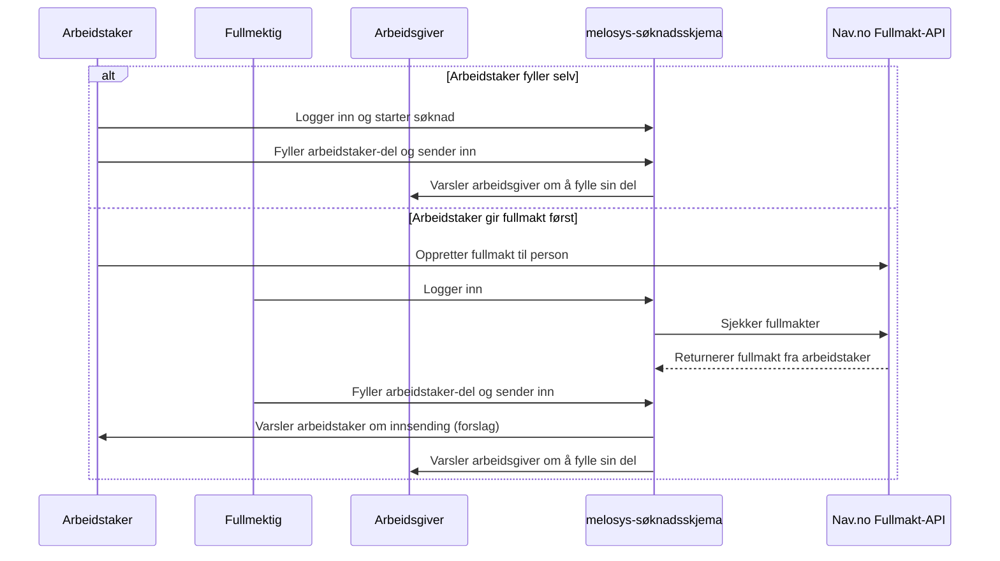

# Fullmaktmodell for Melosys Søknadsskjema

## Oversikt

Dette dokumentet beskriver fullmaktløsningen for søknadssystemet for utsendte arbeidstakere. Systemet bruker **NAVs eksisterende fullmaktsløsning** for å håndtere fullmakter fra arbeidstaker til andre personer.

## Sentrale begreper og roller

### Primære roller
- **Arbeidsgiver**: Norsk virksomhet som sender ut arbeidstaker
- **Arbeidstaker**: Person som sendes ut for arbeid i EU/EØS-land
- **Fullmektig**: Person som har fått fullmakt fra arbeidstaker via Nav.no

### Viktige distinksjoner
- **Altinn-delegering**: Gir tilgang til å opptre på vegne av en organisasjon (arbeidsgiver-delen)
- **Nav.no fullmakt**: Person-til-person fullmakt fra arbeidstaker (arbeidstaker-delen)
- **Fullmaktstype**: "Søknad om medlemskap" eller lignende

---

## Hvordan fullmaktsløsningen fungerer

### 1. Arbeidstaker gir fullmakt
1. Arbeidstaker går til https://www.nav.no/fullmakt
2. Oppretter fullmakt av type "Søknad om medlemskap" (eller lignende)
3. Oppgir personnummer til fullmektig (en person)
4. Bestemmer varighet og omfang

### 2. Vi verifiserer fullmakt
- Vi kaller Nav.no fullmakts-API når person logger inn
- API returnerer: hvem de har fullmakt fra, gyldighetsperiode (fra-dato, til-dato)
- Vi sjekker fullmakt ved innlogging og ved hver relevant operasjon
- Vi kaller API før HVER operasjon (i tilfelle fullmakt trekkes)

### 3. Fullmektig kan fylle søknad
- Fullmektig logger inn med egen ID-porten
- Ser søknader for de arbeidstakere de har fullmakt fra
- Kan fylle/redigere/sende arbeidstaker-delen
- Kan ofte også ha Altinn-delegering fra arbeidsgiver (fyller da begge deler)

---

## Hovedscenarioer

### Scenario 1: Arbeidsgiver ønsker å fylle for arbeidstaker

**Viktige poenger:**
- Arbeidsgiver velger "jeg vil fylle for arbeidstaker"
- System veileder til Nav.no fullmaktsløsning
- **Nav.no fullmakt (arbeidstaker-delen)** gis til en PERSON (ikke til arbeidsgiver-organisasjonen)
- **Altinn-delegering (arbeidsgiver-delen)** kan gis til samme person
- Ofte er fullmektigen en person som også har Altinn-delegering fra arbeidsgiver
- Samme person kan da fylle både arbeidsgiver- og arbeidstaker-delen

---

### Scenario 2: Arbeidsgiver fyller kun sin del

---

### Scenario 3: Arbeidstaker-initiert søknad

---

## Tilgangsstyring - historiske søknader

### Scenario 1: Fullmakt opprettet ETTER at søknad ble sendt inn
- ❌ Fullmektig kan IKKE se søknader som ble sendt før fullmakten ble gitt
- **Logikk**: Fullmakten gjelder kun fremover

### Scenario 2: Fullmakt trukket ETTER at søknad ble sendt inn
- ✅ Fullmektig kan fortsatt SE (read-only) søknader som ble sendt mens fullmakten var aktiv
- ❌ Fullmektig kan IKKE redigere eller sende nye søknader
- **Logikk**: Søknaden ble lovlig sendt på vegne av arbeidstaker, så fullmektig bør kunne se hva de har sendt (sporbarhet/ansvarlighet)

### Scenario 3: Utkast/påbegynte søknader når fullmakt trekkes
- ❌ Fullmektig kan IKKE se eller fortsette med utkast når fullmakten trekkes
- **Logikk**: Kun innsendte søknader "låses" til fullmektig

---

## Tilgangskontroll-matrise

| Aktør | Tilgang til | Forutsetning | Kan redigere? |
|-------|-------------|--------------|---------------|
| Arbeidsgiver | Arbeidsgiver-del | Alltid (egen søknad) | Ja (før innsending) |
| Arbeidsgiver | Arbeidstaker-del | Aldri | Nei |
| Person med Altinn-delegering | Arbeidsgiver-del | Altinn-delegering fra arbeidsgiver | Ja (før innsending) |
| Person med Altinn-delegering | Arbeidstaker-del | Nav.no fullmakt fra arbeidstaker | Ja (før innsending) |
| Arbeidstaker | Arbeidstaker-del | Alltid (egen søknad) | Ja (før innsending) |
| Arbeidstaker | Arbeidsgiver-del | Aldri | Nei |
| Fullmektig | Arbeidstaker-del (utkast) | Aktiv Nav.no fullmakt | Ja |
| Fullmektig | Arbeidstaker-del (innsendt) | Sendt inn mens fullmakt var aktiv | Nei (read-only) |
| Fullmektig | Arbeidstaker-del (innsendt før fullmakt) | Aldri | Nei |

---

## Matching av søknadsdeler

- **Matching skjer via**: FNR (arbeidstaker) + organisasjonsnummer (arbeidsgiver)
- **Fullmektigens ID brukes KUN for**: Tilgangskontroll, IKKE for matching
- **Innsendingsinfo lagres**: Hvem som sendte (FNR), når, via hvilken rolle

---

## Varsling

### Ved fullmaktforespørsel (fra arbeidsgiver)
- Arbeidstaker får varsel på Min side (nav.no)
- Varsel inneholder:
  - Link til Nav.no fullmaktsløsning
  - Alternativ: Fylle selv
  - Frist for å reagere (30 dager?)

### Ved innsending av fullmektig (forslag)
- Arbeidstaker får varsel om at fullmektig har sendt inn på deres vegne
- Varsel inneholder:
  - Hvem som sendte inn
  - Når det ble sendt inn
  - Link til søknaden

---

## Viktige prinsipper

### 1. Kun person-til-person fullmakt (arbeidstaker-delen)
- ✅ Arbeidstaker kan gi **Nav.no fullmakt** til en PERSON for arbeidstaker-delen
- ❌ Arbeidstaker kan IKKE gi Nav.no fullmakt til en organisasjon
- Merk: Arbeidsgiver-delen håndteres via **Altinn-delegering** (kan gis til organisasjon eller person)
- Vi bruker NAVs eksisterende fullmaktsløsning

### 2. Vi gir ikke fullmakt selv
- Vi veileder brukere til Nav.no fullmaktsløsning
- Vi verifiserer fullmakt via Nav.no API
- Vi oppretter ikke fullmakter selv

### 3. Fullmakt gjelder per søknad
- Fullmakt fra Nav.no kan dekke flere søknader (generell fullmakt)
- Men i praksis vil fullmektig kun se søknader de har tilgang til via vårt system
- Vi kan evt. legge til begrensning per søknad senere

### 4. Uavhengighet
- Arbeidsgiver og arbeidstaker kan sende inn sine deler uavhengig
- Matching skjer automatisk via FNR + orgnr
- Journalføring starter når arbeidstaker-del sendes inn

### 5. Alltid verifiser fullmakt
- Kall Nav.no API før hver operasjon
- Arbeidstaker kan trekke fullmakt når som helst
- Cache IKKE fullmaktsstatus

---

## Åpne spørsmål

### Må avklares
1. ✅ **Fullmaktsløsning**: Vi bruker NAVs eksisterende fullmaktsløsning (BESLUTTET)
2. ✅ **Kun person-til-person**: Fullmakt gis kun til personer, ikke organisasjoner (BESLUTTET)
3. 🟡 **Fullmaktstype-navn**: Hva skal den hete? "Søknad om medlemskap" eller noe annet?
4. 🟡 **Varsling ved innsending**: Skal arbeidstaker varsles når fullmektig sender inn? (FORESLÅTT: Ja)
5. 🟡 **Timeout for respons**: Hvor lenge skal arbeidstaker ha på å reagere på veiledning? (30 dager?)
6. 🟡 **Tilgangsstyring detaljer**: Er forslaget for historiske søknader OK?

### Tekniske oppgaver
- Avklare API-endepunkter for Nav.no fullmaktsløsning
- Opprett vår egen fullmaktstype i Nav.no sitt system
- Integrasjon med Nav.no fullmakts-API
- Tilgangskontroll basert på fullmakt
- Veiledning til fullmaktsløsningen i UI
- Varsling til arbeidstaker

---

*Dette dokumentet er oppdatert 21. oktober 2025 med den nye fullmaktsløsningen basert på Nav.no.*
