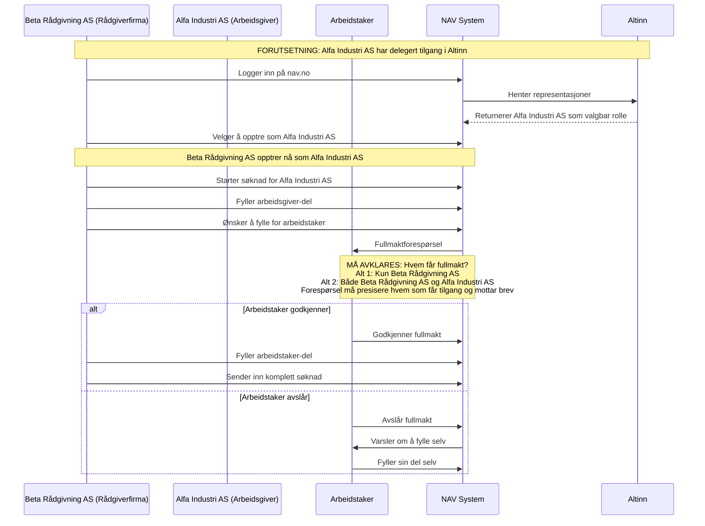
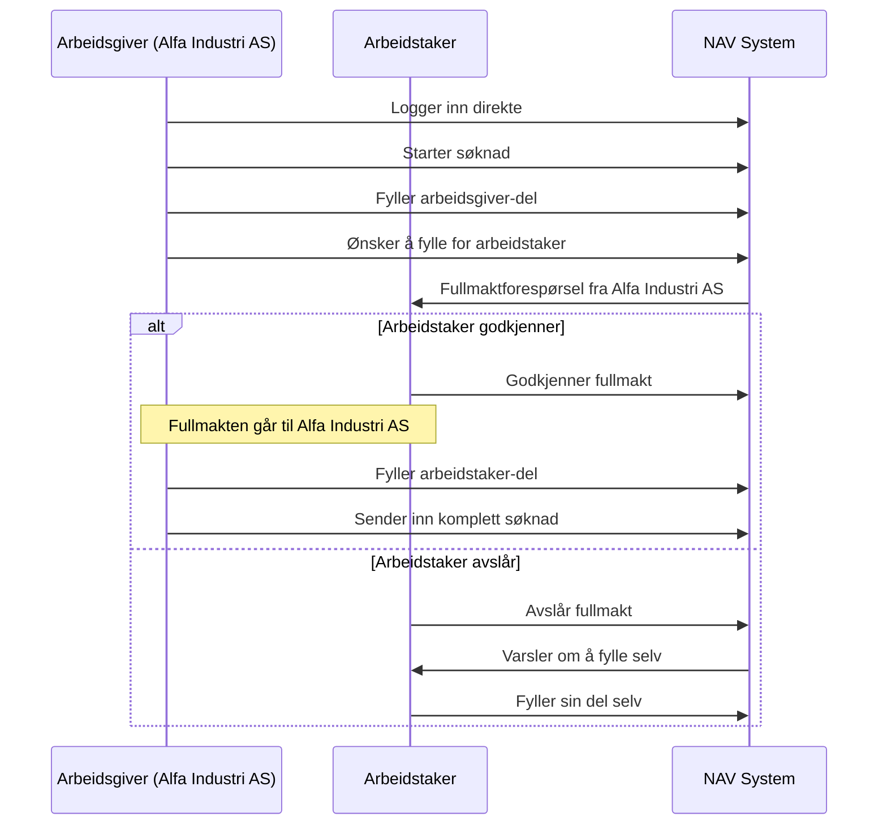
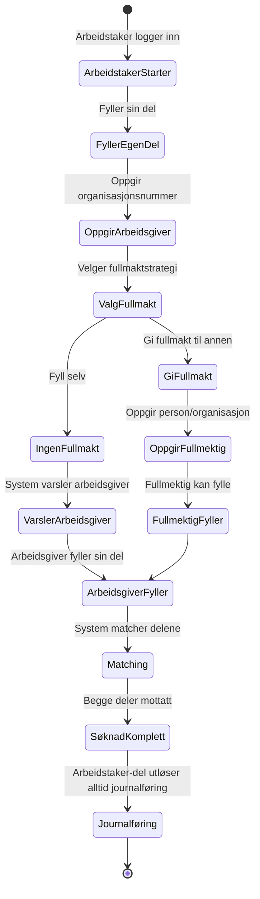
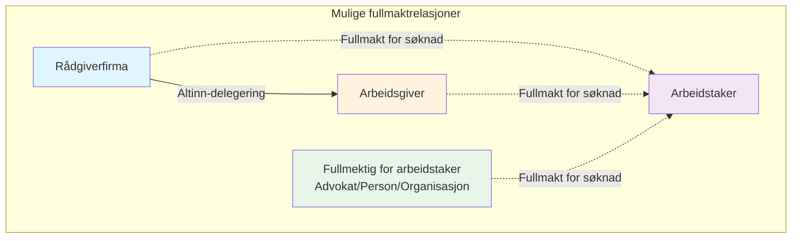
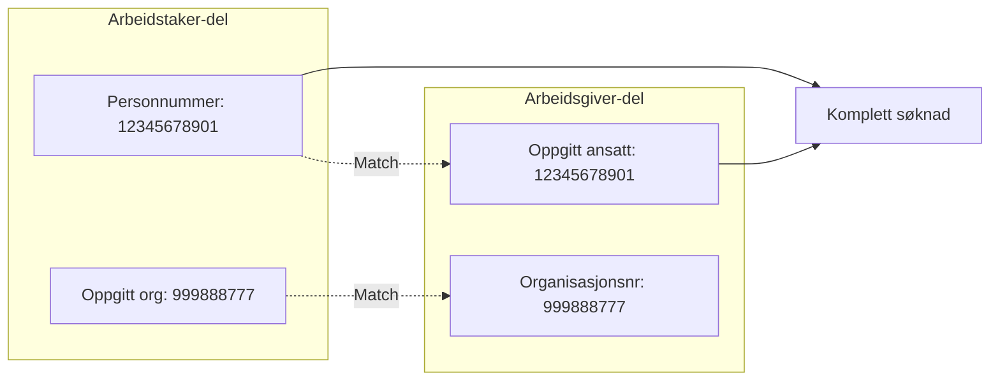

# Fullmaktmodell for Melosys Søknadsskjema

## Oversikt

Dette dokumentet beskriver de ulike fullmaktscenarioene i søknadssystemet for utsendte arbeidstakere. Systemet håndterer komplekse relasjoner mellom flere aktører som kan opptre på vegne av hverandre.

## Sentrale begreper og roller

### Primære roller
- **Arbeidsgiver**: Norsk virksomhet som sender ut arbeidstaker
- **Arbeidstaker**: Person som sendes ut for arbeid i EU/EØS-land
- **Rådgiverfirma**: Konsulentfirma som bistår arbeidsgivere
- **Fullmektig for arbeidstaker**: Person eller organisasjon som kan fylle inn på vegne av arbeidstaker

### Viktige distinksjoner
- **Altinn-delegering**: Gir tilgang til å opptre på vegne av en organisasjon (brukes mellom rådgiverfirma og arbeidsgiver)
- **Fullmakt for søknad**: Gir tilgang til å fylle inn arbeidstaker-delen av en spesifikk søknad
- **Representasjon**: Når man logger inn og velger å opptre som en organisasjon

---

## Fullmaktscenarioer

### Scenario 1: Rådgiverfirma → Arbeidsgiver → Arbeidstaker

**Viktige poenger:**
- **AVKLARING PÅKREVD**: Hvem får fullmakten - kun rådgiverfirma eller både rådgiverfirma og arbeidsgiver?
- Fullmaktforespørselen må tydelig presisere hvem som får tilgang og hvem som mottar brev
- Altinn-delegeringen gir kun tilgang til å opptre som arbeidsgiver, ikke automatisk fullmakt for arbeidstaker
- Fullmakten er knyttet til den spesifikke søknaden

---

### Scenario 2: Arbeidsgiver → Arbeidstaker (uten rådgiverfirma)

**Viktige poenger:**
- Fullmakten går direkte til arbeidsgiver (Alfa Industri AS)
- Hvis rådgiverfirma senere skulle få Altinn-delegering, kan de IKKE se arbeidstaker-delen for den søknaden
- Fullmakten er knyttet til den spesifikke søknaden

---

### Scenario 3: Arbeidstaker-initiert søknad

**To mulige implementasjoner (ikke avklart):**

#### Alternativ A: Arbeidstaker gir fullmakt proaktivt
- Arbeidstaker kan oppgi en fullmektig (person/organisasjon)
- Fullmektigen får varsel og kan fylle arbeidstaker-delen
- Eksempler på fullmektig: advokat, familiemedlem, annen tredjepart

#### Alternativ B: Fullmektig-initiert (mest sannsynlig)
- En person/organisasjon logger inn
- Starter arbeidstaker-del for annen person
- Sender fullmaktforespørsel til arbeidstaker
- Kan fylle inn hvis godkjent
- Fullmektig kan være: advokat, annen privatperson, tredjeparts organisasjon

---

### Scenario 4: Oversikt over mulige fullmaktrelasjoner

**Forklaring:**
- Heltrukken linje = Altinn-delegering (organisatorisk tilgang)
- Stiplet linje = Fullmakt for spesifikk søknad
- Fullmektig for arbeidstaker kan være advokat, privatperson eller tredjeparts organisasjon

---

## Matching av søknadsdeler

Når arbeidstaker og arbeidsgiver fyller inn uavhengig av hverandre, må systemet matche delene:

**Matchingskriterier:**
- Personnummer (arbeidstaker) må matche oppgitt ansatt (arbeidsgiver)
- Organisasjonsnummer må matche på begge sider
- Begge deler må være sendt inn for komplett søknad

**Viktig om journalføring:**
- Journalføring starter når arbeidstaker sender inn sin del (uavhengig av arbeidsgiver-status)
- Søknaden gjelder alltid arbeidstakeren juridisk sett
- Oversiktssiden viser alltid status for begge deler

---

## Tilgangskontroll-matrise

| Aktør | Rolle | Kan se/redigere | Forutsetning |
|-------|-------|-----------------|--------------|
| Rådgiverfirma | Opptrer som arbeidsgiver | Arbeidsgiver-del | Altinn-delegering |
| Rådgiverfirma | Opptrer som arbeidsgiver | Arbeidstaker-del | Fullmakt fra arbeidstaker til RÅDGIVERFIRMA |
| Arbeidsgiver | Seg selv | Arbeidsgiver-del | Alltid |
| Arbeidsgiver | Seg selv | Arbeidstaker-del | Fullmakt fra arbeidstaker til ARBEIDSGIVER |
| Arbeidstaker | Seg selv | Arbeidstaker-del | Alltid |
| Arbeidstaker | Seg selv | Arbeidsgiver-del | Aldri |
| Fullmektig | For arbeidstaker | Arbeidstaker-del | Fullmakt fra arbeidstaker |

---

## Viktige prinsipper

### 1. Fullmakt følger initiativtaker (MÅ AVKLARES)
- Hvis rådgiverfirma (via arbeidsgiver-rolle) ber om fullmakt → fullmakt til rådgiverfirma (eller begge?)
- Hvis arbeidsgiver (direkte) ber om fullmakt → fullmakt til arbeidsgiver
- Fullmakten er IKKE transitiv gjennom Altinn-delegering

### 2. Uavhengighet
- Arbeidsgiver og arbeidstaker kan sende inn sine deler uavhengig
- Systemet matcher automatisk basert på personnummer og organisasjonsnummer
- Ingen part må vente på den andre for å sende sin del

### 3. Søknadsspesifikk fullmakt
- Fullmakt gjelder for én spesifikk søknad (bekreftet beslutning)
- Ikke generell fullmakt for alle fremtidige søknader
- Lettere å implementere og sikrere for brukeren
- Gjelder for ALLE fullmaktscenarioer

### 4. Synlighet
- Altinn-delegering gir IKKE automatisk tilgang til arbeidstaker-delen
- Hver fullmakt må eksplisitt godkjennes av arbeidstaker
- **MÅ AVKLARES**: Kan rådgiverfirma som har fått fullmakt se arbeidstaker-delen når arbeidsgiver ikke kan?

---

## Terminologi-ordbok

For å unngå misforståelser, bruk disse begrepene konsekvent:

| Term | Definisjon | Eksempel |
|------|------------|----------|
| **Altinn-delegering** | Organisatorisk tilgang via Altinn | Alfa Industri AS gir Beta Rådgivning AS tilgang |
| **Fullmakt for søknad** | Tillatelse til å fylle arbeidstaker-del | Arbeidstaker gir fullmakt til Beta Rådgivning AS |
| **Representasjon** | Å opptre på vegne av organisasjon | Beta Rådgivning-ansatt velger Alfa Industri AS-rolle |
| **Fullmektig** | Den som har fått fullmakt | Beta Rådgivning AS er fullmektig for arbeidstaker |
| **Fullmaktsgiver** | Den som gir fullmakt | Arbeidstaker er fullmaktsgiver |
| **Initiativtaker** | Den som ber om fullmakt | Beta Rådgivning AS eller Alfa Industri AS |
| **Matching** | Automatisk sammenkobling av søknadsdeler | System matcher via FNR + orgnr |

---

## Åpne spørsmål og avklaringsbehov

### Må avklares
1. **NAVs eksisterende fullmaktsløsning**: NAV har allerede en fullmaktsløsning for person-til-person representasjon. Skal vi:
   - Bruke NAVs eksisterende løsning for person-til-person fullmakter?
   - Bygge vår egen løsning for både person og organisasjon?
   - *Merk: NAVs løsning støtter IKKE organisasjoner, kun personer*
2. **Hvem får fullmakt i scenario 1**: Når rådgiverfirma ber om fullmakt - får kun de fullmakt, eller både rådgiverfirma og arbeidsgiver?
3. **Synlighet for rådgiverfirma**: Kan rådgiverfirma med fullmakt se arbeidstaker-delen selv om arbeidsgiver ikke kan?
4. **Arbeidstaker-initiert fullmakt**: Skal vi gå for alternativ A eller B? (Se scenario 3)
5. **Tilbaketrekking**: Kan arbeidstaker trekke tilbake fullmakt etter den er gitt?
6. **Historikk**: Skal fullmektig se historiske søknader?
7. **Brev og kommunikasjon**: Hvem mottar brev når fullmakt er gitt?

### Tekniske beslutninger
1. **Datamodell**: Fullmakt per søknad ✅ (BESLUTTET)
2. **Timeout**: 30 dager (FORESLÅTT - må bekreftes)
3. **Varsling**: ✅ Implementeres allerede:
   - Personer får varsel på nav.no (Min side)
   - Organisasjoner får varsel på Altinn
   - Arbeidstaker får oppgave ved fullmaktforespørsel
   - Arbeidstaker får melding når søknad er sendt inn
4. **Implementeringsstrategi for fullmakt**: 🟡 UNDER AVKLARING
   - Alternativ A: Integrere med NAVs eksisterende fullmaktsløsning (kun for person-til-person)
   - Alternativ B: Bygge egen fullmaktsløsning (støtter både person og organisasjon)
   - *Vurdering: Egen løsning gir mer fleksibilitet og kan utvides til organisasjoner*

---

## Kommunikasjonstips

For å unngå forvirring i diskusjoner:

1. **Vær eksplisitt om hvem som får fullmakten**
   - ❌ "De får fullmakt"
   - ✅ "Beta Rådgivning AS får fullmakt fra arbeidstaker"

2. **Skill mellom Altinn-delegering og søknadsfullmakt**
   - ❌ "Rådgiverfirma har fullmakt"
   - ✅ "Beta Rådgivning AS har Altinn-delegering fra Alfa Industri AS OG fullmakt fra arbeidstaker"

3. **Bruk konkrete eksempler med navn**
   - ❌ "Rådgiverfirma sender for arbeidsgiver"
   - ✅ "Beta Rådgivning AS sender søknad på vegne av Alfa Industri AS"

4. **Vær tydelig på kontekst**
   - ❌ "Han kan se søknaden"
   - ✅ "Beta Rådgivning-ansatt kan se arbeidstaker-delen fordi arbeidstaker ga fullmakt til Beta Rådgivning AS"

---

*Dette dokumentet er et levende dokument som oppdateres når flere detaljer avklares.*