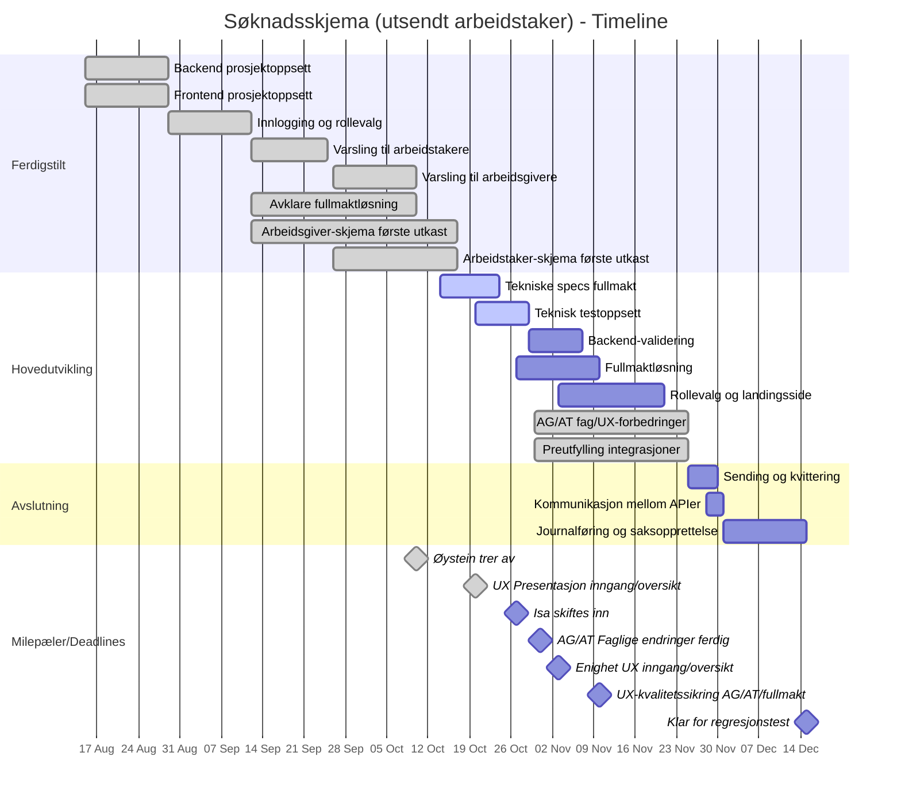

# Melosys søknadsskjema om utsendt arbeidstakere - Epic, stories og oppgaver

## EPIC: Digitalt søknadsskjema (Utsendt arbeidstaker) på Nav.no

**Beskrivelse:** Erstatte Altinn-skjema for utsendt arbeidstaker med moderne løsning på Nav.no

---

## Prosjekt Timeline (15. august - 15. desember)

### Timeline Gantt-diagram

### Viktige detaljer om skjema-utviklingen

**Arbeidsgiver/Arbeidstaker-skjema:**
- **Første utkast (Sept 12 - Okt 17):** ✅ FERDIG - Basert på Nav.no sine skjema (se hoved README for mer kontekst)
- **Faglige endringer (Okt 18-31):** 🔄 PÅGÅENDE - Rette opp basert på feedback. Frist: 31. oktober
- **Faglige/UX-forbedringer (Okt 30 - Nov 25):** Forbedringer basert på UX-kvalitetssikring og feedback - jobbes med i rykk og napp

**Teknisk testoppsett (Okt 20-29):**
Oppsett av teknisk teststruktur og rammeverk.
- **Status:** 🔄 PÅGÅENDE
- **Start:** 20. oktober
- **Ferdig:** 29. oktober

**Fullmaktløsning:**
- **Avklaring (Sept 12 - Okt 10):** ✅ FERDIG - Avklart juridiske krav, brukerflyt og teknisk arkitektur
- **Tekniske specs (Okt 14-24):** 🔄 PÅGÅENDE - Detaljerte tekniske spesifikasjoner
- **Implementering (Okt 27 - Nov 10):** 2 uker - Fullmaktløsningen bygges parallelt med skjema-utviklingen. Dette inkluderer fullmakt mellom arbeidsgiver og arbeidstaker, samt mulighet for fullmakt til annen person/organisasjon.

**Backend-validering (Okt 30 - Nov 7):**
Implementering av backend-validering for skjemafelt (frontend-validering allerede ferdig).
- **Status:** Ikke startet
- **Start:** 30. oktober
- **Ferdig:** 7. november

**Rollevalg og landingsside (Nov 3-21):**
- **Start:** 3. november (etter UX-enighet)
- **Ferdig:** 21. november
- Venter på at UX for inngang/oversikt/landingsside skal bli avklart (3. november)

**Preutfylling integrasjoner (Okt 30 - Nov 25):**
Som del av skjema-arbeidet vil vi integrere mot Enhetsregisteret og A-reg for arbeidsgiver-skjema, og PDL for arbeidstaker-skjema. Dette gjør at brukerne slipper å fylle inn informasjon vi allerede har.
- **Status:** Ikke startet (nice to have)
- **Start:** 30. oktober
- **Note:** Jobbes med i rykk og napp, ikke kontinuerlig - lav prioritet

**UX-arbeid:**
- **Presentasjon (20. oktober):** ✅ FERDIG - UX for inngang/oversiktsside/landingsside presentert (ikke arbeidsgiver, arbeidstaker eller fullmakt-skjema)
- **Enighet om UX inngang/oversikt/landingsside:** 3. november
- **UX-kvalitetssikring og nye skisser:** 10. november - for arbeidsgiver, arbeidstaker og fullmakt-skjema

**Varsling:**
- **Varsling til arbeidstakere (Sept 12-25):** ✅ FERDIG
- **Varsling til arbeidsgivere (Sept 26 - Okt 10):** ✅ FERDIG

**Teambytte:**
- **Øystein trer av:** 10. oktober
- **Isa skiftes inn:** 27. oktober

---

## Stories og oppgaver

### Story 1: Backend prosjektoppsett (MELOSYS-7467) ✅
**Status:** FERDIG  
**Varighet:** 1 uke  

**Som:** Utviklingsteam  
**Ønsker jeg:** En fungerende backend-plattform  
**Slik at:** Vi kan utvikle API og integrasjoner

**Oppgaver:**
- ✅ **TASK-1.1:** Sett opp Spring Boot med Kotlin, database og NAIS-konfigurasjon
- ✅ **TASK-1.2:** Implementer basis REST-endepunkter og health checks
- ✅ **TASK-1.3:** Lage testoppsett
- ✅ **TASK-1.4:** Bytt image i Dockerfile

---

### Story 2: Frontend prosjektoppsett (MELOSYS-7465) ✅
**Status:** FERDIG  
**Varighet:** 1 uke  

**Som:** Utviklingsteam  
**Ønsker jeg:** En fungerende frontend-plattform  
**Slik at:** Vi kan utvikle brukergrensesnitt

**Oppgaver:**
- ✅ **TASK-2.1:** [TEKNISK-ANALYSE] Oppsett frontend for skjemautfylling
- ✅ **TASK-2.2:** Sett opp React 18 med TypeScript, Node/Express proxy, Aksel, routing, basis layout og deploy

---

### Story 3: Innlogging og rollevalg (MELOSYS-7508) ✅
**Status:** FERDIG  
**Varighet:** 2 uker  

**Som:** Bruker  
**Ønsker jeg:** Å logge inn og velge hvem jeg representerer  
**Slik at:** Jeg kan fylle ut skjema for riktig part

**Oppgaver:**
- ✅ **TASK-3.1:** Implementer ID-porten / tokenX token-utveksling med backend og frontend
- ✅ **TASK-3.2:** Integrer Altinn for å hente representasjoner
- ✅ **TASK-3.3:** Implementer rollevalg-UI og kontekstbytte
- 🔄 **TASK-3.4:** Opprett ressurs/delegering i Altinn for søknadsskjema (Teknisk analyse)
  - *Merk: Vi bruker foreløpig testressurs, men vi må opprette endelig ressurs når vi nærmer oss produksjonssetting.*

---

### Story 4: Varsling til brukere (MELOSYS-7561) ✅
**Status:** FERDIG
**Varighet:** 4 uker (sept 12 - okt 10)

**Som:** Arbeidstaker
**Ønsker jeg:** Å få varsel på Min side på Nav.no når min arbeidsgiver ber meg om å godkjenne en fullmakt
**Slik at:** Jeg kan gjøre en vurdering på hvorvidt jeg skal godkjenne fullmakten

**Som:** Arbeidsgiver
**Ønsker jeg:** Å få varsel på Altinn når arbeidstaker har godtatt forespørsel om fullmakt
**Slik at jeg:** Kan fylle inn en søknad på vegne av arbeidstaker

**Oppgaver:**
- ✅ **TASK-4.1:** Funksjonalitet for varsel til bruker med Nav-melding (Ferdig 25. sept)
- ✅ **TASK-4.2:** Funksjonalitet for varsel til arbeidsgiver gjennom Altinn (Ferdig 10. okt)

---

### Story 5: Teknisk testoppsett og validering
**Status:** PÅGÅENDE
**Varighet:** 1 uke
**Start:** 21. oktober
**Ferdig:** 29. oktober

**Som:** Utviklingsteam
**Ønsker jeg:** Et solid testoppsett og valideringssystem
**Slik at:** Vi kan sikre kvalitet på skjemaene og fange feil tidlig

**Akseptansekriterier:**
- Teststruktur for frontend og backend er på plass
- Validering av skjemafelt (frontend og backend)
- Enhetstester for kritisk funksjonalitet
- Integrasjonstester for API-endepunkter

**Oppgaver:**
- **TASK-5.1:** Sett opp teststruktur og rammeverk
- **TASK-5.2:** Implementer frontend-validering for skjemafelt
- **TASK-5.3:** Implementer backend-validering og forretningsregler
- **TASK-5.4:** Lag integrasjonstester for API

---

### Story 6: Arbeidsgiver-skjema (MELOSYS-7513)
**Status:** PLANLAGT  
**Varighet:** 6-8 uker (parallelt med arbeidstaker-skjema)  
**Start:** 26. september  
**Ferdig:** 25. november  

**Som:** Arbeidsgiver  
**Ønsker jeg:** Å fylle ut arbeidsgiverdelen av søknadsskjemaet  
**Slik at:** Jeg kan søke om utsending for min ansatt

**Akseptansekriterier:**
- Arbeidsgiver skal få aktivt valg om de ØNSKER å fylle inn på vegne av arbeidstaker
- Hvis arbeidsgiver velger å ikke fylle for arbeidstaker, skal arbeidstaker varsles om å fylle sin del
- Hvis arbeidsgiver ønsker å fylle for arbeidstaker, må de be om fullmakt
- Rådgiverfirma som opptrer på vegne av arbeidsgiver skal kunne gjøre samme valg
- Preutfylling skal hente data fra Enhetsregisteret og A-reg

**Oppgaver:**
- **TASK-6.1:** Implementer arbeidsgiver-skjema UI med valg for arbeidstaker-utfylling
- **TASK-6.2:** Lag skjema-API med CRUD-operasjoner og validering
- **TASK-6.3:** Implementer preutfylling fra Enhetsregisteret og A-reg
- **TASK-6.4:** Integrer med varslingssystem for arbeidsgiver

---

### Story 7: Arbeidstaker-skjema (MELOSYS-7517)
**Status:** PLANLAGT  
**Varighet:** 6-8 uker (parallelt med arbeidsgiver-skjema)  
**Start:** 26. september  
**Ferdig:** 25. november  

**Som:** Arbeidstaker  
**Ønsker jeg:** Å bli varslet og kunne fylle ut min del  
**Slik at:** Søknaden blir komplett

**Akseptansekriterier:**
- Arbeidstaker kan fylle sin del uavhengig av om arbeidsgiver har startet søknad
- Når arbeidstaker sender inn sin del, skal journalføring starte (juridisk krav)
- Arbeidstaker og arbeidsgiver sin del skal matches automatisk basert på personnummer + organisasjonsnummer
- Arbeidstaker skal kunne se status på oversiktssiden, inkludert om arbeidsgiver har fylt sin del
- Preutfylling skal hente data fra PDL
- Arbeidstaker skal få varsel på nav.no (Min side) ved fullmaktforespørsler eller når de må fylle sin del

**Oppgaver:**
- **TASK-7.1:** Lag arbeidstaker-skjema UI med validering
- **TASK-7.2:** Implementer preutfylling fra PDL
- **TASK-7.3:** Håndter uavhengig innsending av skjemadeler (inkl. matching via FNR + orgnr)
- **TASK-7.4:** Integrer med varslingssystem for arbeidstaker

---

### Story 8: Fullmaktløsning
**Status:** PÅGÅENDE (Tekniske specs)
**Varighet total:** 4 uker (sept 12 - nov 7)
- Avklaring: ✅ FERDIG (sept 12 - okt 10)
- Tekniske specs: 🔄 PÅGÅENDE (okt 14-24)
- Implementering: PLANLAGT (okt 27 - nov 7)

**Som:** System
**Ønsker jeg:** Å håndtere fullmakter mellom ulike parter
**Slik at:** Arbeidsgivere kan fylle ut på vegne av arbeidstakere når de har fått tillatelse

**Akseptansekriterier:**
- Fullmakt gjelder KUN for én spesifikk søknad (ikke generell fullmakt)
- Fullmaktforespørsel må tydelig presisere hvem som får tilgang og hvem som mottar brev
- Når rådgiverfirma ber om fullmakt: MÅ AVKLARES om kun rådgiverfirma eller både rådgiverfirma og arbeidsgiver får fullmakt
- Når arbeidsgiver ber om fullmakt direkte: Fullmakt går til arbeidsgiver
- Fullmakt er IKKE transitiv - hvis rådgiverfirma senere får Altinn-delegering, kan de ikke se arbeidstaker-delen for eksisterende søknader
- Timeout for fullmaktsvar: 30 dager (foreslått - må bekreftes)
- Støtte for fullmektig (advokat/person/organisasjon) som kan fylle på vegne av arbeidstaker
- MÅ AVKLARES: Skal vi bruke NAVs eksisterende fullmaktsløsning for person-til-person, eller bygge egen løsning?

**Oppgaver:**
- 🔄 **TASK-8.0:** Tekniske specs fullmaktløsning (okt 14-24)
- **TASK-8.1:** Implementer fullmakt-API med forespørsel og beslutning
- **TASK-8.2:** Lag fullmakt-UI for både arbeidsgiver og arbeidstaker
- **TASK-8.3:** Håndter tilgangskontroll basert på fullmaktstatus
- **TASK-8.4:** Implementer varsling for fullmaktforespørsler (nav.no for personer, Altinn for organisasjoner)

*Avklaringer som gjenstår: Se fullmakt.md for komplett liste over åpne punkter.*

---

### Story 9: Rollevalg og landingsside
**Status:** IKKE STARTET (venter på UX-avklaring)
**Varighet:** 2 uker
**Start:** 4. november (etter UX-enighet 3. november)
**Ferdig:** 18. november

**Som:** Bruker
**Ønsker jeg:** Å se en landingsside med oversikt over mine skjemaer
**Slik at:** Jeg har kontroll på status, kan starte nye søknader og se utkast

**Akseptansekriterier:**
- Landingssiden skal vise status for både arbeidsgiver-del og arbeidstaker-del
- Bruker skal kunne se om den andre parten har fylt ut sin del
- For rådgiverfirma: Vise søknader de har tilgang til via Altinn-delegering
- For fullmektig: Vise søknader de har fullmakt for
- Støtte rollebytte mellom person og organisasjon(er)

**Oppgaver:**
- **TASK-9.1:** Lag API for å liste skjemaer (innsendte, utkast, status)
- **TASK-9.2:** Implementer rollevalg og landingsside UI med skjemaliste og statusvisning
- **TASK-9.3:** Lag funksjonalitet for å starte ny søknad

---

### Story 10: Kommunikasjon mellom søknadsskjema-api og melosys-api (MELOSYS-7545)
**Status:** PLANLAGT  
**Varighet:** 3 dager  
**Start:** 21. oktober  
**Ferdig:** 25. oktober  

**Som:** Saksbehandler  
**Ønsker jeg:** At innsendte søknader skal bli journalført, komme inn i Melosys som en sak og bli opprettet oppgave på  
**Slik at jeg:** Kan behandle søknadene

**Som:** Utviklingsteam  
**Ønsker vi:** At alle innsendte søknader skal kunne bli hentet av Melosys i bakgrunnen  
**Slik at vi:** Kan følge opp feil som oppstår og rette på de

**Oppgaver:**
- **TASK-10.1:** Sett opp Kafka-producer og meldingsformat
- **TASK-10.2:** Implementer REST-endepunkt for Melosys-API å hente søknadsdata
- **TASK-10.3:** Implementer feilhåndtering og retry-mekanisme

---

### Story 11: Journalføring og saksopprettelse
**Status:** PLANLAGT  
**Varighet:** 2 uker  
**Start:** 1. desember  
**Ferdig:** 15. desember  

**Som:** System  
**Ønsker jeg:** At skjemaer journalføres og opprettes som saker  
**Slik at:** Søknader behandles korrekt i Melosys

**Akseptansekriterier:**
- Journalføring skal starte når ARBEIDSTAKER sender inn sin del (juridisk krav - søknaden gjelder arbeidstakeren)
- Ikke vente på at arbeidsgiver har sendt sin del før journalføring
- System skal håndtere både komplette og delvise søknader
- Saksbehandler skal kunne se status for begge deler i saken

*Merk: Vi må fortsatt avklare hvor og hvordan denne funksjonaliteten skal implementeres. Det kan enten gjøres i Melosys-API eller i denne nye applikasjonen.*

**Oppgaver:**
- **TASK-11.1:** Journalføring av arbeidstaker-del
- **TASK-11.2:** Lag sak og behandling
- **TASK-11.3:** Håndter matching når arbeidsgiver-del kommer inn senere

---

### Story 12: Overvåking
**Status:** IKKE STARTET  
**Varighet:** Løpende ved behov  

**Som:** Driftsteam  
**Ønsker jeg:** Å overvåke systemet  
**Slik at:** Vi kan oppdage og løse problemer raskt

**Oppgaver:**
- **TASK-12.1:** Sett opp Grafana dashboards og alerts
- **TASK-12.2:** Implementer helsesjekker og metrics
- **TASK-12.3:** Sett opp logging og feilsporing

---
