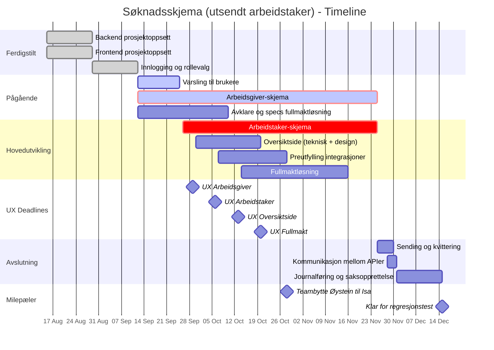

# Melosys søknadsskjema om utsendt arbeidstakere - Epic, stories og oppgaver

## EPIC: Digitalt søknadsskjema (Utsendt arbeidstaker) på Nav.no

**Beskrivelse:** Erstatte Altinn-skjema for utsendt arbeidstaker med moderne løsning på Nav.no

---

## Prosjekt Timeline (15. august - 15. desember)

### Timeline Gantt-diagram

### Viktige detaljer om skjema-utviklingen

**Preutfylling integrasjoner (Okt 7-28):**
Som del av skjema-arbeidet vil vi integrere mot Enhetsregisteret og A-reg for arbeidsgiver-skjema, og PDL for arbeidstaker-skjema. Dette gjør at brukerne slipper å fylle inn informasjon vi allerede har.

**Avklare og specs fullmaktløsning (Sept 12 - Okt 10):**
Før implementering må vi avklare alle detaljer rundt fullmaktløsningen, inkludert juridiske krav, brukerflyt og teknisk arkitektur.

**Fullmaktløsning (Okt 14 - Nov 16):**
Parallelt med skjema-utviklingen bygges fullmaktløsningen. Dette inkluderer fullmakt mellom arbeidsgiver og arbeidstaker, samt mulighet for fullmakt til annen person/organisasjon (detaljer avklares i forrige fase).

**Oversiktside - to faser:**
- **Teknisk fase (30. sept - 13. okt):** Setter opp grunnleggende funksjonalitet og API-er som testplattform
- **Design-implementering (13-20. okt):** Implementerer det endelige designet når UX er klar

**UX-leveranse deadlines:**
- Arbeidsgiver-skjema: 29. september
- Arbeidstaker-skjema: 6. oktober
- Oversiktside: 13. oktober
- Fullmakt-flyter: 20. oktober

---

## Stories og oppgaver

### Story 1: Backend prosjektoppsett (MELOSYS-7467) ✅
**Status:** FERDIG  
**Varighet:** 1 uke  

**Som:** Utviklingsteam  
**Ønsker jeg:** En fungerende backend-plattform  
**Slik at:** Vi kan utvikle API og integrasjoner

**Oppgaver:**
- ✅ **TASK-1.1:** Sett opp Spring Boot med Kotlin, database og NAIS-konfigurasjon
- ✅ **TASK-1.2:** Implementer basis REST-endepunkter og health checks
- ✅ **TASK-1.3:** Lage testoppsett
- ✅ **TASK-1.4:** Bytt image i Dockerfile

---

### Story 2: Frontend prosjektoppsett (MELOSYS-7465) ✅
**Status:** FERDIG  
**Varighet:** 1 uke  

**Som:** Utviklingsteam  
**Ønsker jeg:** En fungerende frontend-plattform  
**Slik at:** Vi kan utvikle brukergrensesnitt

**Oppgaver:**
- ✅ **TASK-2.1:** [TEKNISK-ANALYSE] Oppsett frontend for skjemautfylling
- ✅ **TASK-2.2:** Sett opp React 18 med TypeScript, Node/Express proxy, Aksel, routing, basis layout og deploy

---

### Story 3: Innlogging og rollevalg (MELOSYS-7508) ✅
**Status:** FERDIG  
**Varighet:** 2 uker  

**Som:** Bruker  
**Ønsker jeg:** Å logge inn og velge hvem jeg representerer  
**Slik at:** Jeg kan fylle ut skjema for riktig part

**Oppgaver:**
- ✅ **TASK-3.1:** Implementer ID-porten / tokenX token-utveksling med backend og frontend
- ✅ **TASK-3.2:** Integrer Altinn for å hente representasjoner
- ✅ **TASK-3.3:** Implementer rollevalg-UI og kontekstbytte
- 🔄 **TASK-3.4:** Opprett ressurs/delegering i Altinn for søknadsskjema (Teknisk analyse)
  - *Merk: Vi bruker foreløpig testressurs, men vi må opprette endelig ressurs når vi nærmer oss produksjonssetting.*

---

### Story 4: Varsling til brukere (MELOSYS-7561) 🔄
**Status:** PÅGÅR  
**Varighet:** 2 uker  
**Ferdig:** 25. september  

**Som:** Arbeidstaker  
**Ønsker jeg:** Å få varsel på Min side på Nav.no når min arbeidsgiver ber meg om å godkjenne en fullmakt  
**Slik at:** Jeg kan gjøre en vurdering på hvorvidt jeg skal godkjenne fullmakten

**Som:** Arbeidsgiver  
**Ønsker jeg:** Å få varsel på Altinn når arbeidstaker har godtatt forespørsel om fullmakt  
**Slik at jeg:** Kan fylle inn en søknad på vegne av arbeidstaker

**Oppgaver:**
- 🔄 **TASK-4.1:** Funksjonalitet for varsel til bruker med Nav-melding
- **TASK-4.2:** Funksjonalitet for varsel til arbeidsgiver gjennom Altinn

---

### Story 5: Arbeidsgiver-skjema (MELOSYS-7513)
**Status:** PLANLAGT  
**Varighet:** 6-8 uker (parallelt med arbeidstaker-skjema)  
**Start:** 26. september  
**Ferdig:** 25. november  

**Som:** Arbeidsgiver  
**Ønsker jeg:** Å fylle ut arbeidsgiverdelen av søknadsskjemaet  
**Slik at:** Jeg kan søke om utsending for min ansatt

**Akseptansekriterier:**
- Arbeidsgiver skal få aktivt valg om de ØNSKER å fylle inn på vegne av arbeidstaker
- Hvis arbeidsgiver velger å ikke fylle for arbeidstaker, skal arbeidstaker varsles om å fylle sin del
- Hvis arbeidsgiver ønsker å fylle for arbeidstaker, må de be om fullmakt
- Rådgiverfirma som opptrer på vegne av arbeidsgiver skal kunne gjøre samme valg
- Preutfylling skal hente data fra Enhetsregisteret og A-reg

**Oppgaver:**
- **TASK-5.1:** Implementer arbeidsgiver-skjema UI med valg for arbeidstaker-utfylling
- **TASK-5.2:** Lag skjema-API med CRUD-operasjoner og validering
- **TASK-5.3:** Implementer preutfylling fra Enhetsregisteret og A-reg
- **TASK-5.4:** Integrer med varslingssystem for arbeidsgiver

---

### Story 6: Arbeidstaker-skjema (MELOSYS-7517)
**Status:** PLANLAGT  
**Varighet:** 6-8 uker (parallelt med arbeidsgiver-skjema)  
**Start:** 26. september  
**Ferdig:** 25. november  

**Som:** Arbeidstaker  
**Ønsker jeg:** Å bli varslet og kunne fylle ut min del  
**Slik at:** Søknaden blir komplett

**Akseptansekriterier:**
- Arbeidstaker kan fylle sin del uavhengig av om arbeidsgiver har startet søknad
- Når arbeidstaker sender inn sin del, skal journalføring starte (juridisk krav)
- Arbeidstaker og arbeidsgiver sin del skal matches automatisk basert på personnummer + organisasjonsnummer
- Arbeidstaker skal kunne se status på oversiktssiden, inkludert om arbeidsgiver har fylt sin del
- Preutfylling skal hente data fra PDL
- Arbeidstaker skal få varsel på nav.no (Min side) ved fullmaktforespørsler eller når de må fylle sin del

**Oppgaver:**
- **TASK-6.1:** Lag arbeidstaker-skjema UI med validering
- **TASK-6.2:** Implementer preutfylling fra PDL
- **TASK-6.3:** Håndter uavhengig innsending av skjemadeler
- **TASK-6.4:** Integrer med varslingssystem for arbeidstaker

---

### Story 7: Fullmaktløsning
**Status:** PLANLAGT  
**Varighet:** 5 uker  
**Start:** 14. oktober  
**Ferdig:** 16. november  

**Som:** System  
**Ønsker jeg:** Å håndtere fullmakter mellom ulike parter  
**Slik at:** Arbeidsgivere kan fylle ut på vegne av arbeidstakere når de har fått tillatelse

**Akseptansekriterier:**
- Fullmakt gjelder KUN for én spesifikk søknad (ikke generell fullmakt)
- Fullmaktforespørsel må tydelig presisere hvem som får tilgang og hvem som mottar brev
- Når rådgiverfirma ber om fullmakt: MÅ AVKLARES om kun rådgiverfirma eller både rådgiverfirma og arbeidsgiver får fullmakt
- Når arbeidsgiver ber om fullmakt direkte: Fullmakt går til arbeidsgiver
- Fullmakt er IKKE transitiv - hvis rådgiverfirma senere får Altinn-delegering, kan de ikke se arbeidstaker-delen for eksisterende søknader
- Timeout for fullmaktsvar: 30 dager (foreslått - må bekreftes)
- Støtte for fullmektig (advokat/person/organisasjon) som kan fylle på vegne av arbeidstaker
- MÅ AVKLARES: Skal vi bruke NAVs eksisterende fullmaktsløsning for person-til-person, eller bygge egen løsning?

**Oppgaver:**
- **TASK-7.1:** Implementer fullmakt-API med forespørsel og beslutning
- **TASK-7.2:** Lag fullmakt-UI for både arbeidsgiver og arbeidstaker
- **TASK-7.3:** Håndter tilgangskontroll basert på fullmaktstatus
- **TASK-7.4:** Implementer varsling for fullmaktforespørsler (nav.no for personer, Altinn for organisasjoner)

*Avklaringer som gjenstår: Se fullmakt.md for komplett liste over åpne punkter.*

---

### Story 8: Oversiktside
**Status:** PLANLAGT  
**Varighet:** 2 uker  
**Start:** 11. november  
**Ferdig:** 25. november  

**Som:** Bruker  
**Ønsker jeg:** Å se oversikt over mine skjemaer  
**Slik at:** Jeg har kontroll på status, kan starte nye søknader og se utkast

**Akseptansekriterier:**
- Oversiktssiden skal vise status for både arbeidsgiver-del og arbeidstaker-del
- Bruker skal kunne se om den andre parten har fylt ut sin del
- For rådgiverfirma: Vise søknader de har tilgang til via Altinn-delegering
- For fullmektig: Vise søknader de har fullmakt for
- Støtte rollebytte mellom person og organisasjon(er)

**Oppgaver:**
- **TASK-8.1:** Lag API for å liste skjemaer (innsendte, utkast, status)
- **TASK-8.2:** Implementer oversiktsside UI med skjemaliste og statusvisning
- **TASK-8.3:** Lag funksjonalitet for å starte ny søknad

---

### Story 9: Kommunikasjon mellom søknadsskjema-api og melosys-api (MELOSYS-7545)
**Status:** PLANLAGT  
**Varighet:** 3 dager  
**Start:** 21. oktober  
**Ferdig:** 25. oktober  

**Som:** Saksbehandler  
**Ønsker jeg:** At innsendte søknader skal bli journalført, komme inn i Melosys som en sak og bli opprettet oppgave på  
**Slik at jeg:** Kan behandle søknadene

**Som:** Utviklingsteam  
**Ønsker vi:** At alle innsendte søknader skal kunne bli hentet av Melosys i bakgrunnen  
**Slik at vi:** Kan følge opp feil som oppstår og rette på de

**Oppgaver:**
- **TASK-9.1:** Sett opp Kafka-producer og meldingsformat
- **TASK-9.2:** Implementer REST-endepunkt for Melosys-API å hente søknadsdata
- **TASK-9.3:** Implementer feilhåndtering og retry-mekanisme

---

### Story 10: Journalføring og saksopprettelse
**Status:** PLANLAGT  
**Varighet:** 2 uker  
**Start:** 1. desember  
**Ferdig:** 15. desember  

**Som:** System  
**Ønsker jeg:** At skjemaer journalføres og opprettes som saker  
**Slik at:** Søknader behandles korrekt i Melosys

**Akseptansekriterier:**
- Journalføring skal starte når ARBEIDSTAKER sender inn sin del (juridisk krav - søknaden gjelder arbeidstakeren)
- Ikke vente på at arbeidsgiver har sendt sin del før journalføring
- System skal håndtere både komplette og delvise søknader
- Saksbehandler skal kunne se status for begge deler i saken

*Merk: Vi må fortsatt avklare hvor og hvordan denne funksjonaliteten skal implementeres. Det kan enten gjøres i Melosys-API eller i denne nye applikasjonen.*

**Oppgaver:**
- **TASK-10.1:** Journalføring av arbeidstaker-del
- **TASK-10.2:** Lag sak og behandling
- **TASK-10.3:** Håndter matching når arbeidsgiver-del kommer inn senere

---

### Story 11: Overvåking
**Status:** IKKE STARTET  
**Varighet:** Løpende ved behov  

**Som:** Driftsteam  
**Ønsker jeg:** Å overvåke systemet  
**Slik at:** Vi kan oppdage og løse problemer raskt

**Oppgaver:**
- **TASK-11.1:** Sett opp Grafana dashboards og alerts
- **TASK-11.2:** Implementer helsesjekker og metrics
- **TASK-11.3:** Sett opp logging og feilsporing

---
