# Melosys søknadsskjema om utsendt arbeidstakere - Epic, stories og oppgaver

## EPIC: Digitalt søknadsskjema (Utsendt arbeidstaker) på Nav.no

**Beskrivelse:** Erstatte Altinn-skjema for utsendt arbeidstaker med moderne løsning på Nav.no

---

## Prosjekt Timeline (15. august - 15. desember)

### Timeline Gantt-diagram

```mermaid
gantt
    title Søknadsskjema (utsendt arbeidstaker) - Timeline
    dateFormat YYYY-MM-DD
    axisFormat %d %b
    
    section Ferdigstilt
    Backend prosjektoppsett           :done, backend, 2025-08-15, 14d
    Frontend prosjektoppsett          :done, frontend, 2025-08-15, 14d
    Innlogging og rollevalg           :done, auth, 2025-08-29, 14d
    
    section Pågående
    Varsling til brukere              :active, varsling, 2025-09-12, 2025-09-25
    Arbeidsgiver-skjema               :crit, active, agskjema, 2025-09-12, 2025-11-25
    Avklare og specs fullmaktløsning  :avklarefullmakt, 2025-09-12, 32d
    
    section Hovedutvikling
    Arbeidstaker-skjema               :crit, atskjema, 2025-09-26, 2025-11-25
    Oversiktside (teknisk + design)   :oversikt, 2025-09-30, 20d
    Preutfylling integrasjoner        :prefill, 2025-10-07, 21d
    Fullmaktløsning                   :fullmakt, 2025-10-14, 33d
    
    section UX Deadlines
    UX Arbeidsgiver                   :milestone, uxag, 2025-09-26, 0d
    UX Arbeidstaker                   :milestone, uxat, 2025-10-06, 0d
    UX Oversiktside                   :milestone, uxoversikt, 2025-10-13, 0d
    UX Fullmakt                       :milestone, uxfullmakt, 2025-10-20, 0d
    
    section Avslutning
    Sending og kvittering             :sending, 2025-11-25, 3d
    Kommunikasjon mellom APIer        :komm, 2025-11-28, 3d
    Journalføring og saksopprettelse  :journal, 2025-12-01, 2025-12-15
    
    section Milepæler
    Teambytte Øystein til Isa         :milestone, 2025-10-28, 0d
    Klar for regresjonstest           :milestone, 2025-12-15, 0d
```

### Ferdigstilte oppgaver (15. aug - 15. sept)
- ✅ **Uke 1-2** (15-29 aug): Backend & Frontend prosjektoppsett (parallelt)
- ✅ **Uke 3-4** (29 aug - 12 sept): Innlogging og rollevalg  
- 🔄 **Uke 5** (12-15 sept): Startet Varsling til brukere og Arbeidsgiver-skjema (parallelt)

### Viktige detaljer om skjema-utviklingen

**Preutfylling integrasjoner (Okt 7-28):**
Som del av skjema-arbeidet vil vi integrere mot Enhetsregisteret og A-reg for arbeidsgiver-skjema, og PDL for arbeidstaker-skjema. Dette gjør at brukerne slipper å fylle inn informasjon vi allerede har.

**Avklare og specs fullmaktløsning (Sept 12 - Okt 14):**
Før implementering må vi avklare alle detaljer rundt fullmaktløsningen, inkludert juridiske krav, brukerflyt og teknisk arkitektur.

**Fullmaktløsning (Okt 14 - Nov 16):**
Parallelt med skjema-utviklingen bygges fullmaktløsningen. Dette inkluderer fullmakt mellom arbeidsgiver og arbeidstaker, samt mulighet for fullmakt til annen person/organisasjon (detaljer avklares i forrige fase).

**Oversiktside - to faser:**
- **Teknisk fase (30. sept - 13. okt):** Setter opp grunnleggende funksjonalitet og API-er som testplattform
- **Design-implementering (13-20. okt):** Implementerer det endelige designet når UX er klar

**UX-leveranse deadlines:**
- Arbeidsgiver-skjema: 26. september
- Arbeidstaker-skjema: 6. oktober
- Oversiktside: 13. oktober
- Fullmakt-flyter: 20. oktober

### Gjenstående arbeid - Oppsummering

| Periode | Hovedfokus | Parallelle aktiviteter | Team |
|---------|------------|------------------------|------|
| **15-25 sept** | Varsling ferdig AG-skjema basis | Avklare fullmaktløsning Oversikt teknisk start | Øystein & Øyvind |
| **22 sept - 28 okt** | AG & AT skjemaer Preutfylling | Fullmakt-system Oversiktside | Øystein & Øyvind |
| **28 okt - 25 nov** | Fullføre skjemaer Fullmakt ferdig | Validering & testing | Isa & Øyvind |
| **25 nov - 1 des** | Sending & kvittering Kommunikasjon API-er | Integrasjonstesting | Isa & Øyvind |
| **1-15 des** | Journalføring Saksopprettelse | Sluttesting | Isa & Øyvind |

---

## Stories og oppgaver

### Story 1: Backend prosjektoppsett (MELOSYS-7467) ✅
**Status:** FERDIG  
**Varighet:** 1 uke  

**Som:** Utviklingsteam  
**Ønsker jeg:** En fungerende backend-plattform  
**Slik at:** Vi kan utvikle API og integrasjoner

**Oppgaver:**
- ✅ **TASK-1.1:** Sett opp Spring Boot med Kotlin, database og NAIS-konfigurasjon
- ✅ **TASK-1.2:** Implementer basis REST-endepunkter og health checks
- ✅ **TASK-1.3:** Lage testoppsett
- ✅ **TASK-1.4:** Bytt image i Dockerfile

---

### Story 2: Frontend prosjektoppsett (MELOSYS-7465) ✅
**Status:** FERDIG  
**Varighet:** 1 uke  

**Som:** Utviklingsteam  
**Ønsker jeg:** En fungerende frontend-plattform  
**Slik at:** Vi kan utvikle brukergrensesnitt

**Oppgaver:**
- ✅ **TASK-2.1:** [TEKNISK-ANALYSE] Oppsett frontend for skjemautfylling
- ✅ **TASK-2.2:** Sett opp React 18 med TypeScript, Node/Express proxy, Aksel, routing, basis layout og deploy

---

### Story 3: Innlogging og rollevalg (MELOSYS-7508) ✅
**Status:** FERDIG  
**Varighet:** 2 uker  

**Som:** Bruker  
**Ønsker jeg:** Å logge inn og velge hvem jeg representerer  
**Slik at:** Jeg kan fylle ut skjema for riktig part

**Oppgaver:**
- ✅ **TASK-3.1:** Implementer ID-porten / tokenX token-utveksling med backend og frontend
- ✅ **TASK-3.2:** Integrer Altinn for å hente representasjoner
- ✅ **TASK-3.3:** Implementer rollevalg-UI og kontekstbytte
- 🔄 **TASK-3.4:** Opprett ressurs/delegering i Altinn for søknadsskjema (Teknisk analyse)

---

### Story 4: Varsling til brukere (MELOSYS-7561) 🔄
**Status:** PÅGÅR  
**Varighet:** 2 uker  
**Ferdig:** 25. september  

**Som:** Arbeidstaker  
**Ønsker jeg:** Å få varsel på Min side på Nav.no når min arbeidsgiver ber meg om å godkjenne en fullmakt  
**Slik at:** Jeg kan gjøre en vurdering på hvorvidt jeg skal godkjenne fullmakten

**Som:** Arbeidsgiver  
**Ønsker jeg:** Å få varsel på Altinn når arbeidstaker har godtatt forespørsel om fullmakt  
**Slik at jeg:** Kan fylle inn en søknad på vegne av arbeidstaker

**Oppgaver:**
- 🔄 **TASK-4.1:** Funksjonalitet for varsel til bruker med Nav-melding
- **TASK-4.2:** Funksjonalitet for varsel til arbeidsgiver gjennom Altinn

---

### Story 5: Arbeidsgiver-skjema (MELOSYS-7513)
**Status:** PLANLAGT  
**Varighet:** 6-8 uker (parallelt med arbeidstaker-skjema)  
**Start:** 26. september  
**Ferdig:** 25. november  

**Som:** Arbeidsgiver  
**Ønsker jeg:** Å fylle ut arbeidsgiverdelen av søknadsskjemaet  
**Slik at:** Jeg kan søke om utsending for min ansatt

**Oppgaver:**
- **TASK-5.1:** Implementer arbeidsgiver-skjema UI med valg for arbeidstaker-utfylling
- **TASK-5.2:** Lag skjema-API med CRUD-operasjoner og validering
- **TASK-5.3:** Implementer preutfylling fra Enhetsregisteret og A-reg
- **TASK-5.4:** Implementer fullmakt-API med forespørsel og beslutning
- **TASK-5.5:** Lag fullmakt-UI og håndter tilgangskontroll basert på fullmaktstatus

---

### Story 6: Arbeidstaker-skjema (MELOSYS-7517)
**Status:** PLANLAGT  
**Varighet:** 6-8 uker (parallelt med arbeidsgiver-skjema)  
**Start:** 26. september  
**Ferdig:** 25. november  

**Som:** Arbeidstaker  
**Ønsker jeg:** Å bli varslet og kunne fylle ut min del  
**Slik at:** Søknaden blir komplett

**Oppgaver:**
- **TASK-6.1:** Lag arbeidstaker-skjema UI med validering
- **TASK-6.2:** Implementer preutfylling fra PDL
- **TASK-6.3:** Håndter uavhengig innsending av skjemadeler
- **TASK-6.4:** Integrer med varslingssystemet fra Story 4

---

### Story 7: Oversiktside
**Status:** PLANLAGT  
**Varighet:** 2 uker  
**Start:** 11. november  
**Ferdig:** 25. november  

**Som:** Bruker  
**Ønsker jeg:** Å se oversikt over mine skjemaer  
**Slik at:** Jeg har kontroll på status, kan starte nye søknader og se utkast

**Oppgaver:**
- **TASK-7.1:** Lag API for å liste skjemaer (innsendte, utkast, status)
- **TASK-7.2:** Implementer oversiktsside UI med skjemaliste
- **TASK-7.3:** Lag funksjonalitet for å starte ny søknad
- **TASK-7.4:** Implementer statusvisning og filtrering
- **TASK-7.5:** Lag detaljvisning for enkeltskjemaer

---

### Story 8: Kommunikasjon mellom søknadsskjema-api og melosys-api (MELOSYS-7545)
**Status:** PLANLAGT  
**Varighet:** 3 dager  
**Start:** 21. oktober  
**Ferdig:** 25. oktober  

**Som:** Saksbehandler  
**Ønsker jeg:** At innsendte søknader skal bli journalført, komme inn i Melosys som en sak og bli opprettet oppgave på  
**Slik at jeg:** Kan behandle søknadene

**Som:** Utviklingsteam  
**Ønsker vi:** At alle innsendte søknader skal kunne bli hentet av Melosys i bakgrunnen  
**Slik at vi:** Kan følge opp feil som oppstår og rette på de

**Oppgaver:**
- **TASK-8.1:** Sett opp Kafka-producer og meldingsformat
- **TASK-8.2:** Implementer REST-endepunkt for Melosys-API å hente søknadsdata
- **TASK-8.3:** Implementer feilhåndtering og retry-mekanisme

---

### Story 9: Journalføring og saksopprettelse
**Status:** PLANLAGT  
**Varighet:** 2 uker  
**Start:** 25. november  
**Ferdig:** 9. desember  

**Som:** System  
**Ønsker jeg:** At komplette skjemaer journalføres og opprettes som saker  
**Slik at:** Søknader behandles korrekt i Melosys

**Oppgaver:**
- **TASK-9.1:** Journalfør dokument
- **TASK-9.2:** Lag sak og behandling for søknad sendt gjennom nav.no
- **TASK-9.3:** Generer og lagre PDF av innsendt skjema
- **TASK-9.4:** Implementer arkivering av dokumenter

---

### Story 10: Overvåking
**Status:** IKKE STARTET  
**Varighet:** Løpende ved behov  

**Som:** Driftsteam  
**Ønsker jeg:** Å overvåke systemet  
**Slik at:** Vi kan oppdage og løse problemer raskt

**Oppgaver:**
- **TASK-10.1:** Sett opp Grafana dashboards og alerts
- **TASK-10.2:** Implementer helsesjekker og metrics
- **TASK-10.3:** Sett opp logging og feilsporing

---
